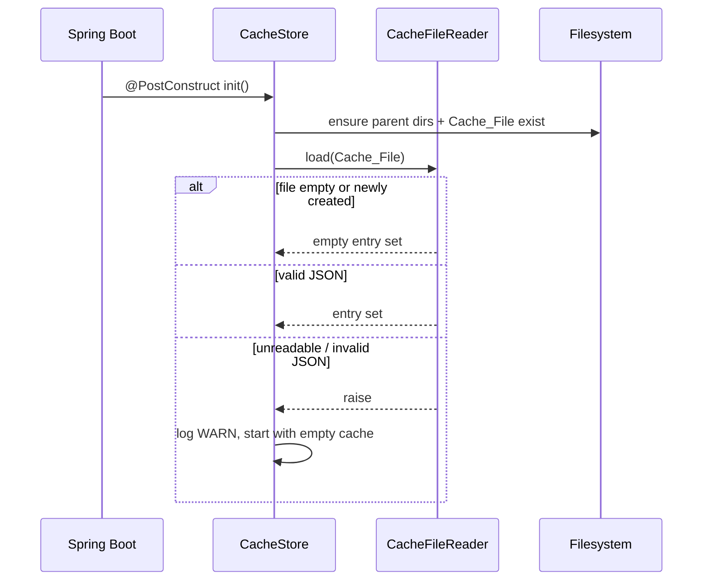

# Design Document

## Overview

The Prompt Caching feature adds a file-backed cache of AI-agent prompts (and their optional
responses) to the existing Spring Boot backend. Each submitted prompt is normalized to a canonical
form, hashed into a stable fixed-length key, and stored as a `CacheEntry` in an in-memory map that is
mirrored to a single JSON `Cache_File` on the server filesystem. Identical future prompts derive the
same key, so they are recognized as cache hits without creating duplicate entries. The cache enforces
size and age limits through eviction, serializes all writes to protect the file from concurrent
corruption, and reports failures through the project's existing `ErrorResponse` shape.

The feature follows the established layering (`controller` → `service` → a file-backed store that
plays the role a repository plays elsewhere), constructor injection, `@ConfigurationProperties`
binding, `@RestControllerAdvice` error handling, and springdoc-openapi documentation. It deliberately
does **not** use JPA: the requirements mandate a JSON file on the filesystem, not a relational table,
so the persistence boundary is a dedicated `CacheStore` abstraction rather than a Spring Data
repository.

### Key design decisions

- **In-memory map is the source of truth for reads; the file is the durable mirror.** Lookups,
  key matching, and eviction ordering all run against an in-memory structure for speed (Requirement
  8.6's latency budget). Every mutation is flushed to the file before the operation reports success
  (Requirements 1.3, 3.7, 3.8, 5.6), so a restart reloads an equivalent state (Requirement 4.4, 4.6).
- **A single global write lock serializes all file writes.** The requirements call for serialized
  writes with a 5-second acquisition timeout (Requirements 6.1, 6.2) and atomic, non-partial reads
  (Requirement 6.5). A `ReentrantReadWriteLock` guarding the in-memory map plus atomic file replacement
  (temp file + atomic move) satisfies both without a database.
- **Normalization and key derivation are pure functions.** They are isolated into a `PromptNormalizer`
  and `CacheKeyDeriver` so their determinism, stability, and collision behavior are unit- and
  property-testable in isolation (Requirements 2.1–2.6).
- **The cache never breaks prompt submission on a load failure.** A corrupt or unreadable file at
  startup degrades to an empty in-memory cache with a WARN log (Requirements 7.1, 7.2), rather than
  failing application startup.
- **DTOs never expose the internal `CacheEntry`.** Request/response records mirror the existing DTO
  convention, with camelCase JSON, ISO-8601 timestamps, and springdoc `@Schema` annotations.

## Architecture

```mermaid
flowchart TD
    Client[Frontend / API client] -->|POST /api/v1/prompt-cache| Controller[PromptCacheController]
    Client -->|GET /api/v1/prompt-cache/&#123;cacheKey&#125;| Controller
    Controller -->|DTOs| Service[PromptCacheService]
    Service --> Normalizer[PromptNormalizer]
    Service --> KeyDeriver[CacheKeyDeriver]
    Service --> Store[CacheStore]
    Service --> Evictor[EvictionPolicy]
    Store -->|read/write under lock| File[(Cache_File JSON)]
    Store --> Reader[CacheFileReader]
    Store --> Writer[CacheFileWriter]
    Reader --> File
    Writer --> File
    Controller -.throws.-> Advice[GlobalExceptionHandler]
    Config[PromptCacheProperties] --> Service
    Config --> Store
    Config --> Evictor
```



### Layer responsibilities

| Component | Responsibility |
|-----------|----------------|
| `PromptCacheController` | HTTP concerns only: request mapping, `@Valid` trigger, status codes, `Location` header, springdoc annotations. No business logic. |
| `PromptCacheService` | Orchestrates normalize → derive key → lookup → hit/miss handling → eviction → persist. Owns the concurrency semantics. |
| `PromptNormalizer` | Pure function: raw prompt text → canonical normalized text. |
| `CacheKeyDeriver` | Pure function: normalized text + response-affecting params → fixed-length key; detects hash collisions. |
| `EvictionPolicy` | Pure function over the entry set: computes which entries to evict for TTL expiry and max-size. |
| `CacheStore` | In-memory map guarded by a read/write lock; the single point that mutates state and delegates durable writes. |
| `CacheFileReader` / `CacheFileWriter` | JSON (de)serialization and atomic file I/O. |
| `PromptCacheProperties` | `@ConfigurationProperties` binding for path, TTL, max size, with range validation and defaulting. |

### Startup sequence



## Components and Interfaces

### PromptCacheController

REST boundary under `/api/v1/prompt-cache`, annotated with springdoc `@Operation`/`@ApiResponse`
(Requirement 8.7), mirroring `TicketController`.

- `POST /api/v1/prompt-cache` — submit a prompt. Body: `SubmitPromptRequest`. Returns `200 OK` with
  `PromptSubmissionResponse` on a cache hit (Requirement 8.1), or `201 Created` with a `Location`
  header (`/api/v1/prompt-cache/{cacheKey}`) on a new entry (Requirement 8.2).
- `GET /api/v1/prompt-cache/{cacheKey}` — inspect a cached entry. Returns `200 OK` with
  `CacheEntryResponse` for a matching non-expired entry (Requirement 8.3) or `404 Not Found`
  otherwise (Requirement 8.4).

The controller derives no policy; it delegates to `PromptCacheService` and lets
`GlobalExceptionHandler` translate exceptions.

### PromptCacheService

```java
public interface PromptCacheService {

    /** Submit a prompt: normalize, derive key, look up, record hit/miss, evict, and persist. */
    PromptSubmissionResult submit(SubmitPromptRequest request);

    /** Read a cache entry by key, treating an expired entry as absent (and removing it). */
    Optional<CacheEntryView> findByKey(String cacheKey);
}
```

`submit` semantics:

1. Normalize the raw prompt; reject if empty after normalization (Requirement 1.5) or if the raw text
   exceeds 100000 chars (Requirement 1.6, boundary inclusive).
2. Derive the key (Requirements 1.1, 2.1–2.5); on a detected collision, reject with a key-derivation
   error and leave the existing entry unchanged (Requirement 2.6).
3. Under the write lock: look up the key.
   - **Miss**: apply TTL/size eviction, create a new entry (hit count 0), persist, report a miss with
     the new entry (Requirements 1.2, 3.4, 5.4, 5.5, 8.2).
   - **Hit** (non-expired): increment hit count by exactly one, set last-accessed to now, persist, and
     report a hit with the entry and its stored response if present (Requirements 1.4, 3.2, 3.3, 3.5,
     3.6, 3.7, 8.1).
   - **Expired hit**: treat as a miss and remove the expired entry (Requirement 5.4), then follow the
     miss path.

`findByKey` treats an expired entry as a `Cache_Miss` and removes it (Requirement 5.4), returning
empty so the controller answers 404.

### PromptNormalizer

```java
public final class PromptNormalizer {
    /** Trim leading/trailing whitespace and collapse internal whitespace runs to a single space. */
    public String normalize(String rawPrompt);
}
```

Pure and deterministic (Requirements 2.1, 2.2). Uses the same whitespace definition as the existing
`TrimmedSizeValidator` (wider than `String.strip()` — includes non-breaking spaces) for consistency
across the codebase.

### CacheKeyDeriver

```java
public final class CacheKeyDeriver {
    /** Derive a fixed-length key from normalized text + response-affecting params (SHA-256 hex). */
    public String deriveKey(String normalizedText, ResponseParams params);
}
```

- Fixed-length output for all inputs (Requirement 2.5): SHA-256 rendered as 64 lowercase hex chars.
- Deterministic and collision-sensitive detection: the service passes the derived key plus the
  normalized-text-and-params tuple to the store; if the key already maps to an entry whose stored
  canonical identity differs, that is a collision → key-derivation failure (Requirement 2.6). The
  canonical identity (normalized text + serialized params) is stored on the entry so a match can be
  confirmed rather than assumed.

### EvictionPolicy

```java
public final class EvictionPolicy {
    /** Entries whose age >= TTL relative to `now`. */
    List<CacheEntry> expired(Collection<CacheEntry> entries, Instant now, Duration ttl);

    /** Entries to remove so the remaining count <= maxSize, LRU then oldest-created first. */
    List<CacheEntry> overflow(Collection<CacheEntry> entries, int maxSize);
}
```

Pure functions over the entry set. `overflow` orders eviction candidates by ascending last-accessed
timestamp, breaking ties by ascending creation timestamp (Requirement 5.5). Applying eviction twice
with no intervening change yields the same remaining set (Requirement 5.7, idempotence).

### CacheStore

```java
public interface CacheStore {
    Optional<CacheEntry> get(String cacheKey);
    Collection<CacheEntry> snapshot();
    /** Mutate the in-memory map and durably persist, under the write lock, atomically. */
    void mutateAndPersist(Consumer<Map<String, CacheEntry>> mutation);
}
```

- Backed by a `HashMap<String, CacheEntry>` guarded by a `ReentrantReadWriteLock`.
- `mutateAndPersist` acquires the write lock with a 5-second timeout (Requirements 6.1, 6.2); on
  timeout it throws a `CacheUnavailableException` (→ 500 via the advice) and leaves state untouched.
- After mutating the in-memory map it delegates to `CacheFileWriter`, which writes to a temp file and
  performs an atomic move so a reader never observes a partial file (Requirements 6.5, 7.3). If the
  write fails, the in-memory mutation is rolled back (the store keeps a pre-mutation snapshot) so
  memory and file stay consistent and no partial file remains (Requirement 7.3).

### CacheFileReader / CacheFileWriter

- `CacheFileWriter.write(Collection<CacheEntry>)` serializes to JSON via the shared Jackson
  `ObjectMapper` (JSR-310 module already installed), writes to `<file>.tmp`, then
  `Files.move(..., ATOMIC_MOVE, REPLACE_EXISTING)` (Requirements 4.1, 6.5).
- `CacheFileReader.read()` deserializes the JSON array of entries; an empty or newly created file
  yields an empty set (Requirement 4.5); invalid JSON raises, which the store converts to "start
  empty + WARN" at startup (Requirement 7.1).

### PromptCacheProperties

```java
@ConfigurationProperties(prefix = "prompt-cache")
public class PromptCacheProperties {
    private Path file;              // default: ./data/prompt-cache.json (documented)
    private int maxEntries;         // range 1..1_000_000, default 10_000
    private Duration ttl;           // range 1s..31_536_000s, default 604_800s (7 days)
}
```

Binding applies range validation; an out-of-range or unparseable value is rejected, the default is
applied, and a WARN is logged (Requirement 5.3). Because Boot binding failures normally abort startup,
sanitization happens in a `@PostConstruct`/binding-normalization step that clamps to defaults rather
than failing, so the app still starts with safe values.

## Data Models

### CacheEntry (internal domain / persisted record)

Persisted as JSON; also the in-memory value. Uses a Java record for immutability, with a builder-style
copy for updates (hit count / last-accessed changes produce a new record).

```java
public record CacheEntry(
    String cacheKey,            // fixed-length derived key
    String promptText,          // original (raw) prompt text as submitted
    String canonicalIdentity,   // normalized text + serialized params, for collision confirmation
    String cachedResponse,      // nullable; absent when no response stored yet
    Instant createdAt,          // creation timestamp
    Instant lastAccessedAt,     // last-accessed timestamp
    long hitCount               // >= 0
) {}
```

JSON shape in the `Cache_File` (array of entries):

```json
[
  {
    "cacheKey": "a1b2...64hex",
    "promptText": "Summarize this ticket",
    "canonicalIdentity": "summarize this ticket|model=gpt-4",
    "cachedResponse": "The ticket describes ...",
    "createdAt": "2026-09-05T10:15:30Z",
    "lastAccessedAt": "2026-09-05T10:20:00Z",
    "hitCount": 3
  }
]
```

Two entries are equal for the round-trip property when cacheKey, promptText, cachedResponse,
createdAt, lastAccessedAt, and hitCount are equal (Requirement 4.6).

### ResponseParams

Value object for response-affecting parameters (e.g. model identifier). Serialized deterministically
(sorted keys) into `canonicalIdentity` so identical params always yield identical serialization
(Requirements 2.3, 2.4).

### DTOs

**SubmitPromptRequest** (request body, `POST`):

```java
public record SubmitPromptRequest(
    @NotNull @TrimmedSize(min = 1, max = 100000) String prompt,   // empty-after-normalize and length bounds
    String model,                                                  // optional response-affecting param
    String response                                                // optional cached response to store
) {}
```

`@TrimmedSize(min = 1, ...)` rejects whitespace-only prompts at the boundary (Requirement 1.5, 8.5);
`max = 100000` enforces the length cap with the boundary inclusive (Requirement 1.6). Additional
service-layer validation covers the "response supplied for a non-matching key" case (Requirement 3.9).

**PromptSubmissionResponse** (response body, `POST`):

```java
public record PromptSubmissionResponse(
    String cacheKey,
    boolean cacheHit,
    String cachedResponse   // nullable; present only when a response is stored
) {}
```

Covers Requirements 8.1 (hit, `cacheHit=true`) and 8.2 (new entry, `cacheHit=false`).

**CacheEntryResponse** (response body, `GET`):

```java
public record CacheEntryResponse(
    String cacheKey,
    String promptText,
    Instant createdAt,
    Instant lastAccessedAt,
    long hitCount
) {}
```

Covers Requirement 8.3. All timestamps ISO-8601; all field names camelCase; each field annotated with
springdoc `@Schema`.

### Exceptions

Reusing the existing `ApiException` hierarchy:

- `ValidationException` (400) — empty-after-normalize, length exceeded, response-for-missing-key
  (Requirements 1.5, 1.6, 3.9, 7.4).
- `NotFoundException` (404) — `GET` by key with no matching non-expired entry (Requirement 8.4).
- New `CacheUnavailableException extends ApiException` (500) — write-lock timeout (Requirement 6.2),
  key-derivation failure (Requirement 2.6), and persistence failure (Requirement 7.3), each with a
  client-safe message and no internal detail.

## Correctness Properties

*A property is a characteristic or behavior that should hold true across all valid executions of a
system — essentially, a formal statement about what the system should do. Properties serve as the
bridge between human-readable specifications and machine-verifiable correctness guarantees.*

The properties below were derived from the acceptance-criteria prework and then reduced to remove
redundancy: the several hit-update criteria (1.4, 3.2, 3.3, 3.5, 3.6) collapse into one hit property;
the durability criteria (1.3, 3.7, 3.8, 5.6) collapse into the serialization round-trip; and the
mechanism-only criteria (1.1, 2.1, 3.1, 4.1) are validated implicitly by the derivation and round-trip
properties. Each remaining property provides unique validation value.

### Property 1: Normalization is deterministic

*For any* raw prompt string, applying normalization to that string always produces the same
normalized text, so key derivation over it is deterministic.

**Validates: Requirements 2.1, 2.2**

### Property 2: Whitespace-variant prompts derive identical keys

*For any* raw prompt text and any variant of it that differs only in incidental whitespace (leading,
trailing, or collapsible internal runs), with identical response-affecting parameters, the derived
Cache_Keys are identical.

**Validates: Requirements 1.1, 2.3**

### Property 3: Distinct canonical identities derive distinct keys

*For any* two prompts whose normalized text differs, or whose response-affecting parameters differ in
at least one value, the derived Cache_Keys are different (absent an injected hash collision, which is
handled by Property 5).

**Validates: Requirements 2.4**

### Property 4: Keys are fixed length

*For any* prompt, regardless of the length of its input text, the derived Cache_Key has the same fixed
length as the key derived from any other prompt.

**Validates: Requirements 2.5**

### Property 5: Collision detection rejects and preserves the existing entry

*For any* two prompts with different canonical identities that are forced (via a test seam) to derive
the same Cache_Key, submitting the second is rejected with a key-derivation error that exposes no
internal detail, and the Cache_Entry already stored for that key is left unchanged.

**Validates: Requirements 2.6**

### Property 6: Empty-after-normalization submissions are rejected without side effect

*For any* prompt string that is empty after normalization (including any string composed solely of
whitespace), submitting it is rejected with a validation error and neither creates nor persists any
Cache_Entry, leaving the cache unchanged.

**Validates: Requirements 1.5**

### Property 7: A miss creates exactly one entry and reports a miss

*For any* valid prompt whose derived key is not present in the cache, submitting it reports a
Cache_Miss, creates exactly one Cache_Entry for that key with a hit count of zero and equal creation
and last-accessed timestamps, and adds no other entry for that key.

**Validates: Requirements 1.2, 3.4**

### Property 8: A hit updates access metadata, never duplicates, and returns the stored response iff present

*For any* valid prompt whose derived key already maps to a non-expired Cache_Entry, submitting it
reports a Cache_Hit, increments that entry's hit count by exactly one, sets its last-accessed
timestamp to the submission time, keeps exactly one entry for the key, and returns the stored cached
response when one is present and an explicit no-response indication when none is stored.

**Validates: Requirements 1.4, 3.2, 3.3, 3.5, 3.6**

### Property 9: Serialization round-trip preserves the entry set

*For any* set of Cache_Entries, writing the set to the Cache_File and then reading it back produces a
set of Cache_Entries equal to the original, where equality is over cacheKey, original prompt text,
cached response, creation timestamp, last-accessed timestamp, and hit count. Consequently, after any
successful submit the reloaded state reflects the created or updated entry.

**Validates: Requirements 4.6, 1.3, 3.7, 3.8, 5.6**

### Property 10: Expired entries are treated as misses and removed

*For any* Cache_Entry whose age (current time minus creation timestamp) is greater than or equal to
the configured TTL, a lookup for its key reports a Cache_Miss and removes the expired entry from the
cache.

**Validates: Requirements 5.4**

### Property 11: Overflow eviction bounds size and respects LRU-then-oldest ordering

*For any* set of Cache_Entries and configured maximum, applying overflow eviction leaves at most the
configured maximum number of entries, and every evicted entry orders at or before every retained
entry under ascending last-accessed timestamp with ties broken by ascending creation timestamp.

**Validates: Requirements 5.5**

### Property 12: Eviction is idempotent

*For any* set of Cache_Entries, applying eviction twice with no intervening change produces the same
remaining set on the second application as on the first.

**Validates: Requirements 5.7**

### Property 13: Out-of-range configuration resolves to the default

*For any* configured maximum-entries value outside 1..1,000,000 or configured TTL outside
1..31,536,000 seconds (or a value that cannot be interpreted as the expected type), the effective
value used by the cache equals the corresponding documented default.

**Validates: Requirements 5.3**

### Property 14: Concurrent same-key submissions retain one entry and sum the hits

*For any* count N of concurrent submissions that all derive the same Cache_Key, after all complete the
cache retains exactly one Cache_Entry for that key and that entry's hit count has increased by exactly
N over its pre-submission value.

**Validates: Requirements 6.3**

### Property 15: Concurrent distinct-key submissions lose no entry

*For any* set of concurrent submissions deriving distinct Cache_Keys whose total does not exceed the
configured maximum, after all complete the cache retains exactly one Cache_Entry for each distinct
derived key with none lost.

**Validates: Requirements 6.4**

## Error Handling

All failures are translated into the existing single `ErrorResponse` shape by the shared
`@RestControllerAdvice` (`GlobalExceptionHandler`), which already emits ISO-8601 `timestamp`, numeric
`status`, `error`, client-safe `message`, and request `path` (Requirements 7.5, 7.4). The prompt-cache
feature adds no new advice; it maps its failures onto the existing hierarchy plus one new exception.

| Condition | Exception | Status | Notes |
|-----------|-----------|--------|-------|
| Empty-after-normalization prompt | `ValidationException` (via `@TrimmedSize`) | 400 | Nothing persisted (Req 1.5, 8.5). |
| Prompt exceeds 100000 chars | `ValidationException` (via `@TrimmedSize` max) | 400 | Boundary 100000 inclusive (Req 1.6). |
| Malformed / missing-field body | `HttpMessageNotReadableException` / `MethodArgumentNotValidException` | 400 | Handled by existing advice (Req 8.5). |
| Response supplied for non-matching key | `ValidationException` | 400 | Not persisted (Req 3.9). |
| `GET` by key with no non-expired match | `NotFoundException` | 404 | Standard shape (Req 8.4). |
| Key-derivation collision | `CacheUnavailableException` (new) | 500 | No internal detail; existing entry unchanged (Req 2.6). |
| Write-lock acquisition timeout (>5s) | `CacheUnavailableException` (new) | 500 | Prior entries unchanged (Req 6.2). |
| Writer failure persisting the file | `CacheUnavailableException` (new) | 500 | No partial file; in-memory mutation rolled back (Req 7.3). |

Startup-time failures are handled inside `CacheStore`, not the advice, because there is no request in
flight:

- **Unreadable file or invalid JSON at startup** → log at WARN, start with an empty in-memory cache
  (Requirement 7.1), and continue accepting submissions against that empty cache (Requirement 7.2).
- **Invalid configuration values** → clamp to the documented defaults and log at WARN, rather than
  aborting startup (Requirement 5.3).

`CacheUnavailableException` extends `ApiException`, declares `HttpStatus.INTERNAL_SERVER_ERROR`, and
carries only a constant client-safe message (e.g. "The prompt cache is temporarily unavailable.").
The full cause is logged server-side at ERROR and never placed in the response body, matching the
existing "never leak internals" rule.

The write path preserves the file invariant: writes go to a temporary file and are promoted with an
atomic move, so a failure leaves either the prior complete file or the new complete file, never a
partial one (Requirements 6.5, 7.3), and the temporary file is cleaned up on failure.

## Testing Strategy

Property-based testing **is** appropriate for this feature: normalization, key derivation, JSON
serialization, and eviction are pure functions with clear input/output behavior and large input
spaces, and the concurrency guarantees are universal invariants. The Testing Strategy therefore pairs
example-based unit/slice tests with jqwik property tests, consistent with the workspace testing
guidelines.

### Tooling

- **JUnit 5 + AssertJ** for unit and slice tests.
- **Mockito** for collaborator boundaries (e.g. a failing `CacheFileWriter`, a pinned `Clock`).
- **jqwik** for the property tests, minimum **100 iterations** per property (jqwik's default `@Property`
  tries ≥ 100), with `@Provide` generators for prompts, whitespace variants, `ResponseParams`, and
  `CacheEntry` sets.
- **`@WebMvcTest`** slice tests for `PromptCacheController` (status codes, `Location` header, JSON
  field casing, error shapes — Requirements 8.1–8.5).
- **`@SpringBootTest`** (no Testcontainers needed — the store is file-backed) with a temp-directory
  `Cache_File` for startup/load/round-trip integration (Requirements 4.3, 4.4, 6.5) and the springdoc
  `/v3/api-docs` documentation smoke check (Requirement 8.7).
- A **pinned `Clock`** (the existing `ClockConfig` bean, overridden with `Clock.fixed` in tests) makes
  timestamp and TTL properties deterministic rather than timing-dependent.

### Property tests (jqwik)

Each property test is tagged with a comment in the format
`Feature: prompt-caching, Property {number}: {property_text}` and references the design property it
validates. Co-located with unit tests and named `<Class>PropertyTest.java` per the steering doc:

| Property | Test location | Generators |
|----------|---------------|------------|
| P1 normalization determinism | `PromptNormalizerPropertyTest` | arbitrary strings incl. mixed whitespace/Unicode |
| P2 whitespace-variant equal keys | `CacheKeyDeriverPropertyTest` | text + whitespace-perturbed variant |
| P3 distinct identity → distinct key | `CacheKeyDeriverPropertyTest` | pairs of distinct canonical identities |
| P4 fixed-length key | `CacheKeyDeriverPropertyTest` | arbitrary prompts incl. empty/huge |
| P5 collision detection | `PromptCacheServicePropertyTest` | injected key-deriver forcing collisions |
| P6 empty-after-normalize rejected | `PromptCacheServicePropertyTest` | whitespace-only strings |
| P7 miss creates one entry | `PromptCacheServicePropertyTest` | valid prompts vs empty store |
| P8 hit update semantics | `PromptCacheServicePropertyTest` | prompts with/without stored response |
| P9 serialization round-trip | `CacheFileRoundTripPropertyTest` | generated `Set<CacheEntry>` |
| P10 expiry → miss + removal | `PromptCacheServicePropertyTest` | ages/TTLs with fixed clock |
| P11 overflow eviction ordering | `EvictionPolicyPropertyTest` | entry sets + max sizes |
| P12 eviction idempotence | `EvictionPolicyPropertyTest` | entry sets + max sizes |
| P13 config out-of-range → default | `PromptCachePropertiesPropertyTest` | values inside/outside ranges |
| P14 concurrent same-key sum hits | `PromptCacheConcurrencyPropertyTest` | N concurrent identical submits |
| P15 concurrent distinct-key retained | `PromptCacheConcurrencyPropertyTest` | distinct prompt sets ≤ max |

### Example-based and edge-case tests

- **Length boundary** (Req 1.6): prompts of exactly 100000 chars (accepted) and 100001 (rejected).
- **Empty / newly-created file** (Req 4.5): both yield an empty in-memory set.
- **Corrupt JSON at startup** (Req 7.1, 7.2): store starts empty, logs WARN, still accepts submits.
- **Writer failure** (Req 7.3): injected failing writer → 500 standard shape, no partial/temp file,
  in-memory state rolled back.
- **Write-lock timeout** (Req 6.2): hold the lock, submit → 500, file unchanged.
- **Response-for-missing-key** (Req 3.9): rejected, nothing persisted.
- **Controller slice** (Req 8.1–8.5): 200 hit body, 201 + `Location` for new, 200 `GET` body, 404
  miss, 400 for malformed/missing/blank/over-long.
- **Config defaults** (Req 4.2, 5.1, 5.2): absent config yields documented default path, 10,000 max,
  7-day TTL.
- **OpenAPI smoke** (Req 8.7): `/v3/api-docs` documents each endpoint's request/response schemas and
  every status code.

### Out of scope for automated logic tests

- **Latency p95 ≤ 500ms under 50 concurrent requests** (Req 8.6) is a performance target verified by a
  load/performance test, not a unit or property test.

### Coverage bar

Per the steering doc, each new piece of business logic (normalization, key derivation, hit/miss
handling, eviction, config resolution) has example tests for the happy path, boundary conditions, and
at least one failure path, complemented by the property tests above. Tests are independent and
order-independent; each store/integration test uses a fresh temp `Cache_File`.
