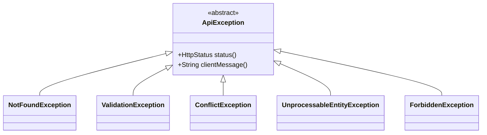
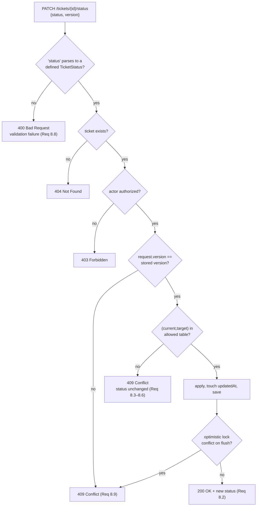

# Design Document

## Overview

The Support Ticket Management System is a two-tier application: a layered Spring Boot backend (`ticket-service`) that owns all business rules, validation, and persistence, and a React/Next.js frontend (`Ticket_UI`) that consumes the backend REST API.

The design is driven by three non-negotiable constraints from the requirements:

1. **The backend is the sole authority on validity.** All length, enum, and state-machine rules are enforced server-side and are independent of any frontend validation (Req 10.1). The frontend may validate for responsiveness, but never as a substitute.
2. **Validation is atomic and fail-closed.** No record is modified until every field of a request has passed validation (Req 10.5). This is achieved by validating at the controller boundary via `jakarta.validation` before any service method executes, and by wrapping each write in a single service-layer transaction.
3. **The status state machine is pure, isolated logic.** Transition legality is decided by a dependency-free component (`TicketStatusTransitionValidator`) that knows nothing about JPA, HTTP, or Spring. This makes the most safety-critical rule in the system directly property-testable (Req 8.1–8.6).

### Research Notes and Key Decisions

**Trimmed_Length cannot be expressed by `@Size` alone.** Bean Validation's `@Size` counts raw characters, so `@Size(min = 1)` accepts `"   "`. Two mechanisms are combined: a custom `@TrimmedSize(min, max)` constraint that trims before measuring, and Jackson's `ACCEPT_EMPTY_STRING_AS_NULL` left *disabled* so that whitespace-only input reaches the validator intact.

**`String.strip()` is not a wide enough whitespace set.** `strip()` delegates to `Character.isWhitespace`, which *excludes* non-breaking spaces by design, so `"\u00A0"` survives `strip()` and NBSP-only text would be accepted as a one-character title — contradicting both the Trimmed_Length glossary entry and the NBSP case in Property 7. `TrimmedSizeValidator` therefore trims code points matching `Character.isWhitespace(cp) || Character.isSpaceChar(cp)`, which adds NBSP (`U+00A0`), narrow NBSP (`U+202F`), and figure space (`U+2007)` on top of everything `strip()` removes. Trimming iterates by code point so a supplementary character is never split; the reported length stays in `char` units to match `@Size` and the `VARCHAR` column widths the constraint shadows. Req 5.8 additionally requires the empty/whitespace check on comment content to run against the *raw* submitted value before any sanitization, so no trimming/sanitizing Jackson deserializer is registered on that field — sanitization, if added later, must happen in the service after validation.

**Enum coercion must fail, not default.** Spring MVC's default behavior for an unknown enum value in a `@RequestBody` is a `HttpMessageNotReadableException` (→ 400), and for an unknown enum in a *query parameter* it is a `MethodArgumentTypeMismatchException` (→ 400 by default handler). Both map to 400 in the advice, which satisfies Req 1.5, 7.3, and 8.8. Critically, this means an unknown target status on a transition request is a **400 (validation)**, while a *known but illegal* target status is a **409 (conflict)** — these are two different code paths and are deliberately kept separate (Req 8.3 vs 8.8).

**Optimistic locking gives concurrency control for free, but only if the client round-trips the version.** `@Version` on `Ticket` produces a `ObjectOptimisticLockingFailureException` on conflicting flush. Requests carry the expected version explicitly (a `version` field in the update/transition body), so a stale-read update is rejected even when the two writes do not interleave inside a single transaction (Req 4.6, 8.9).

**Pinned versions** (Spring Boot parent BOM manages transitive versions; the entries below are declared explicitly):

| Dependency | Version | Purpose |
|---|---|---|
| `spring-boot-starter-parent` | 3.3.5 | BOM / dependency management |
| Java | 21 (LTS) | records, pattern matching, sealed types |
| `spring-boot-starter-web`, `-validation`, `-data-jpa` | via BOM | API, validation, persistence |
| `postgresql` | via BOM (42.7.x) | non-local database driver |
| `h2` | via BOM (2.2.x) | local dev / test database |
| `flyway-core`, `flyway-database-postgresql` | via BOM (10.x) | schema migrations |
| `springdoc-openapi-starter-webmvc-ui` | 2.6.0 | OpenAPI 3 / Swagger UI |
| `net.jqwik:jqwik` | 1.9.1 (test) | property-based testing |
| `org.testcontainers:postgresql`, `:junit-jupiter` | via BOM | integration-test database |

Version alignment note: jqwik 1.9.1 targets JUnit Platform 1.10/1.11, which is what Boot 3.3.5 supplies. If the Boot version is raised, the jqwik version must be re-checked against the JUnit Platform version rather than left to drift.

## Architecture

### System Components

```mermaid
graph TB
    subgraph Frontend["Ticket_UI — React / Next.js"]
        LIST[Ticket List View<br/>pagination, status filter, keyword search]
        DETAIL[Ticket Detail View<br/>fields + comments]
        FORMS[Create / Edit Forms]
        APIC[apiClient<br/>fetch wrapper]
        ERRH[errorHandler<br/>status → single message]
        LIST --> APIC
        DETAIL --> APIC
        FORMS --> APIC
        APIC --> ERRH
    end

    subgraph Backend["ticket-service — Spring Boot 3.3 / Java 21"]
        subgraph Web["controller"]
            TC[TicketController]
            CC[CommentController]
            ADVICE[GlobalExceptionHandler<br/>@RestControllerAdvice]
        end
        subgraph Svc["service"]
            TS[TicketService]
            CS[CommentService]
            AUTHZ[TicketAuthorizationService]
            VALID[TicketStatusTransitionValidator<br/>pure, no dependencies]
            TS --> VALID
            TS --> AUTHZ
            CS --> AUTHZ
        end
        subgraph Map["dto + mapper"]
            MAP[TicketMapper / CommentMapper]
        end
        subgraph Repo["repository"]
            TR[TicketRepository]
            CR[CommentRepository]
        end
        subgraph Dom["domain"]
            TE[Ticket entity<br/>@Version]
            CE[Comment entity]
        end
        TC --> TS
        CC --> CS
        TS --> MAP
        CS --> MAP
        TS --> TR
        CS --> CR
        TR --> TE
        CR --> CE
    end

    DB[(PostgreSQL — non-local<br/>H2 — local dev/test)]
    FW[Flyway migrations]

    APIC -->|"HTTPS /api/v1"| TC
    APIC -->|"HTTPS /api/v1"| CC
    TR --> DB
    CR --> DB
    FW -->|"startup, non-local profiles"| DB
```

### Package Structure

Layering follows the Java/Spring Boot steering doc: `com.<org>.<service>.<layer>`.

```
com.ticketsystem.ticket
├── TicketServiceApplication.java
├── controller
│   ├── TicketController.java
│   ├── CommentController.java
│   └── GlobalExceptionHandler.java        @RestControllerAdvice
├── service
│   ├── TicketService.java                 interface
│   ├── TicketServiceImpl.java
│   ├── CommentService.java                interface
│   ├── CommentServiceImpl.java
│   ├── TicketAuthorizationService.java    interface — service-layer authz (Req 3.5)
│   ├── DefaultTicketAuthorizationService.java
│   ├── AssigneeValidator.java             interface — existence check (Req 4.5)
│   ├── DirectoryBackedAssigneeValidator.java
│   ├── UserDirectory.java                 interface — identity lookup boundary (Req 4.5)
│   ├── ConfiguredUserDirectory.java       backed by UserDirectoryProperties
│   └── TicketStatusTransitionValidator.java   PURE logic, unit/property tested
├── repository
│   ├── TicketRepository.java              extends JpaRepository, JpaSpecificationExecutor
│   └── CommentRepository.java
├── domain
│   ├── Ticket.java
│   ├── Comment.java
│   ├── TicketStatus.java                  enum + allowed-transition table
│   └── TicketPriority.java
├── dto
│   ├── request  (CreateTicketRequest, UpdateTicketRequest, StatusTransitionRequest,
│   │             CreateCommentRequest, TicketQueryParams)
│   ├── response (TicketSummaryResponse, TicketDetailResponse, CommentResponse,
│   │             PagedResponse<T>, ErrorResponse, FieldError)
│   └── mapper   (TicketMapper, CommentMapper)
├── validation
│   ├── TrimmedSize.java                   custom constraint annotation
│   └── TrimmedSizeValidator.java
├── config
│   ├── OpenApiConfig.java
│   ├── SecurityConfig.java
│   ├── JacksonConfig.java
│   ├── TicketProperties.java              @ConfigurationProperties
│   └── UserDirectoryProperties.java       @ConfigurationProperties — known assignees
└── exception
    ├── ApiException.java                  abstract base
    ├── NotFoundException.java             → 404
    ├── ValidationException.java           → 400
    ├── ForbiddenException.java            → 403
    ├── ConflictException.java             → 409
    └── UnprocessableEntityException.java  → 422
```

### Layer Responsibilities

| Layer | Owns | Explicitly does not |
|---|---|---|
| Controller | Request mapping, `@Valid` trigger, status codes, `Location` headers, OpenAPI annotations | Business rules, transition legality, persistence |
| Service | Transition enforcement, authorization, assignee existence checks, `@Transactional` boundaries, timestamp updates | HTTP concerns, JSON shape |
| `TicketStatusTransitionValidator` | The allowed-transition table and the decision function | Anything requiring a Spring context or a database |
| Repository | Spring Data JPA queries (derived, `@Query` JPQL, and `Specification` composition for search + filter) | Business rules |
| Mapper | Explicit entity ↔ DTO conversion | Persistence, validation |

### Environment and Persistence Profiles

| Profile | Database | Schema strategy | Rationale |
|---|---|---|---|
| `local` (Local_Development_Environment) | H2 in-memory | `ddl-auto: update` permitted, Flyway disabled | Req 9.6 explicitly permits automatic generation locally |
| `test` | H2 in-memory (slice tests) / Testcontainers PostgreSQL (integration) | Flyway enabled against Testcontainers to exercise real migrations | Req 9.4 — `test` is a non-local environment |
| `prod` / `staging` | PostgreSQL | Flyway only; `ddl-auto: validate` | Req 9.4 forbids automatic generation |

Migration failure behavior (Req 9.5, 9.7): Flyway runs during `ApplicationContext` refresh, *before* the embedded web server begins accepting connections. A failed migration therefore throws during startup, the context fails to refresh, the JVM exits non-zero, and no listener socket is ever opened — so there are no in-flight requests to abandon and no request can be served. `flyway.baseline-on-migrate` is left `false` and `flyway.validate-on-migrate` is `true` so drift is detected rather than papered over.

## Components and Interfaces

### TicketStatusTransitionValidator (pure logic)

The single most important design decision: transition legality is a pure function, so it can be exhaustively property-tested without a Spring context, a database, or mocks.

```java
/** Decides whether a ticket status transition is permitted. Pure: no I/O, no state. */
public final class TicketStatusTransitionValidator {

    /** @return true iff (from, to) appears in the allowed-transition table. */
    public boolean isPermitted(TicketStatus from, TicketStatus to);

    /** @return the permitted target states for {@code from}; empty for terminal states. */
    public Set<TicketStatus> permittedTargets(TicketStatus from);

    /**
     * @throws ConflictException if the transition is not permitted, with a message naming
     *         both the current and requested status (consumed by the UI per Req 8.7).
     */
    public void requirePermitted(TicketStatus from, TicketStatus to);
}
```

The table itself lives on the enum so it cannot drift from the type:

```java
public enum TicketStatus {
    OPEN, IN_PROGRESS, RESOLVED, CLOSED, CANCELLED;

    private static final Map<TicketStatus, Set<TicketStatus>> ALLOWED = Map.of(
        OPEN,        EnumSet.of(IN_PROGRESS, CANCELLED),
        IN_PROGRESS, EnumSet.of(RESOLVED, CANCELLED),
        RESOLVED,    EnumSet.of(CLOSED),
        CLOSED,      EnumSet.noneOf(TicketStatus.class),   // terminal
        CANCELLED,   EnumSet.noneOf(TicketStatus.class));  // terminal

    public Set<TicketStatus> allowedTargets() { return ALLOWED.get(this); }
    public boolean isTerminal() { return ALLOWED.get(this).isEmpty(); }
}
```

Because same-status pairs are absent from every row of the table, Req 8.4 (reject same-status with 409) falls out of the table rather than needing a separate branch — one rule, one place.

### TicketService

```java
public interface TicketService {
    TicketDetailResponse create(CreateTicketRequest request, String actor);
    PagedResponse<TicketSummaryResponse> list(TicketQueryParams params, String actor);
    TicketDetailResponse getById(UUID id, String actor);
    TicketDetailResponse update(UUID id, UpdateTicketRequest request, String actor);
    TicketDetailResponse transitionStatus(UUID id, StatusTransitionRequest request, String actor);
}
```

`transitionStatus` sequence:

```mermaid
sequenceDiagram
    participant UI as Ticket_UI
    participant C as TicketController
    participant S as TicketServiceImpl
    participant V as TransitionValidator
    participant R as TicketRepository
    UI->>C: PATCH /api/v1/tickets/{id}/status {status, version}
    C->>C: @Valid — unknown enum value → 400 (Req 8.8)
    C->>S: transitionStatus(id, request, actor)
    S->>R: findById(id)
    R-->>S: Optional<Ticket>
    alt absent
        S-->>C: NotFoundException → 404
    end
    S->>S: authorize(actor, ticket) — else 403
    S->>S: require request.version == ticket.version — else 409 (Req 4.6/8.9)
    S->>V: requirePermitted(current, target)
    alt not in table (incl. same-status, terminal source)
        V-->>S: ConflictException → 409, status unchanged (Req 8.3–8.6)
    end
    S->>S: ticket.setStatus(target); touch updatedAt
    S->>R: save(ticket) — @Version check on flush
    alt OptimisticLockingFailure
        R-->>S: → 409 (Req 8.9)
    end
    S-->>C: TicketDetailResponse
    C-->>UI: 200 OK {status: ...}
```

### Search and Filter Composition

Keyword search and status filter are composed as JPA `Specification`s, never string-concatenated JPQL (parameterized by construction):

```java
final class TicketSpecifications {
    /** Case-insensitive substring match on title OR description. */
    static Specification<Ticket> keywordMatches(String keyword);
    /** Exact status match; returns null (no-op) when status is absent. */
    static Specification<Ticket> hasStatus(TicketStatus status);
}
```

`list()` builds `Specification.allOf(keywordMatches(k), hasStatus(s))`, dropping null components. Because both predicates are conjunctive, the combined result is necessarily a subset of either applied alone — the structural reason the corresponding correctness property holds (Req 6.5).

Case-insensitivity is implemented as `lower(field) like lower(concat('%', :kw, '%'))` so it does not depend on database collation settings, which differ between H2 and PostgreSQL. The keyword is passed as a bound parameter; `%` and `_` inside the keyword are escaped so a user-supplied wildcard cannot broaden the match.

### Controller Surface

`TicketController` and `CommentController` hold no logic beyond mapping, validation triggering, and status/header construction. Every handler carries `@Operation` plus `@ApiResponse` entries for each documented status code, and every DTO field with a non-obvious constraint carries `@Schema(description = ...)`.

## Data Models

### Entities

Entities are **never** exposed to the API. Controllers accept and return DTOs exclusively; `TicketMapper`/`CommentMapper` perform explicit conversion. This keeps `@Version`, JPA lazy proxies, and internal columns out of the wire format.

```java
@Entity
@Table(name = "ticket")
public class Ticket {
    @Id @GeneratedValue private UUID id;

    @Column(nullable = false, length = 200)   private String title;        // stored trimmed
    @Column(length = 5000)                    private String description;
    @Enumerated(EnumType.STRING)
    @Column(nullable = false, length = 20)    private TicketStatus status;
    @Enumerated(EnumType.STRING)
    @Column(nullable = false, length = 20)    private TicketPriority priority;
    @Column(length = 100)                     private String assignee;     // nullable → "Unassigned"

    @Column(nullable = false, updatable = false) private Instant createdAt;
    @Column(nullable = false)                    private Instant updatedAt;

    @Version private long version;   // optimistic locking — Req 4.6, 8.9

    @OneToMany(mappedBy = "ticket", cascade = ALL, orphanRemoval = true)
    @OrderBy("createdAt ASC, id ASC")
    private List<Comment> comments = new ArrayList<>();
}

@Entity
@Table(name = "comment")
public class Comment {
    @Id @GeneratedValue private UUID id;

    @ManyToOne(fetch = LAZY, optional = false)
    @JoinColumn(name = "ticket_id", nullable = false) private Ticket ticket;

    @Column(nullable = false, length = 100)  private String author;
    @Column(nullable = false, length = 5000) private String content;   // stored trimmed
    @Column(nullable = false, updatable = false) private Instant createdAt;
}
```

Field constraints and their enforcement points:

| Field | Constraint | Enforced at |
|---|---|---|
| `title` | present, Trimmed_Length 1–200 | `@TrimmedSize(min=1,max=200)` on request DTO; `NOT NULL length(200)` in DB |
| `description` | ≤ 5000 | `@Size(max=5000)` on DTO; `length(5000)` in DB |
| `status` | enum, transitions gated | enum binding (400 on unknown); validator (409 on illegal) |
| `priority` | enum, required on create | enum binding (400 on unknown); `@NotNull` on create DTO |
| `assignee` | ≤ 100, nullable, must exist | `@Size(max=100)` (400); `AssigneeValidator` (422) |
| `comment.content` | present, raw non-blank, Trimmed_Length 1–5000 | `@NotNull` + `@TrimmedSize(min=1,max=5000)` against the **raw** value (Req 5.8) |
| `createdAt` / `updatedAt` | never null, ISO-8601 on the wire | service sets both on create; service touches `updatedAt` on every mutation |
| `version` | optimistic lock | `@Version`; client-supplied expected value on update/transition |

Timestamps are stored as `Instant` (UTC, `timestamptz` in PostgreSQL) and serialized as ISO-8601 with a `Z` offset (`2026-09-05T10:15:30Z`) via `JacksonConfig` disabling `WRITE_DATES_AS_TIMESTAMPS`.

### Sort Order

The ticket list defaults to `createdAt DESC, id DESC`. The secondary `id` key makes ordering total, so pagination cannot duplicate or skip rows when several tickets share a `createdAt` — a prerequisite for the pagination correctness property.

### Flyway Migration Outline

`src/main/resources/db/migration/V1__create_ticket_and_comment.sql`:

```sql
CREATE TABLE ticket (
    id          UUID         PRIMARY KEY,
    title       VARCHAR(200) NOT NULL,
    description VARCHAR(5000),
    status      VARCHAR(20)  NOT NULL,
    priority    VARCHAR(20)  NOT NULL,
    assignee    VARCHAR(100),
    created_at  TIMESTAMPTZ  NOT NULL,
    updated_at  TIMESTAMPTZ  NOT NULL,
    version     BIGINT       NOT NULL DEFAULT 0,
    CONSTRAINT ck_ticket_status   CHECK (status   IN ('OPEN','IN_PROGRESS','RESOLVED','CLOSED','CANCELLED')),
    CONSTRAINT ck_ticket_priority CHECK (priority IN ('LOW','MEDIUM','HIGH','CRITICAL')),
    CONSTRAINT ck_ticket_title_not_blank CHECK (length(btrim(title)) BETWEEN 1 AND 200)
);

CREATE TABLE comment (
    id         UUID          PRIMARY KEY,
    ticket_id  UUID          NOT NULL REFERENCES ticket(id) ON DELETE CASCADE,
    author     VARCHAR(100)  NOT NULL,
    content    VARCHAR(5000) NOT NULL,
    created_at TIMESTAMPTZ   NOT NULL,
    CONSTRAINT ck_comment_content_not_blank CHECK (length(btrim(content)) BETWEEN 1 AND 5000)
);

CREATE INDEX ix_ticket_status_created  ON ticket (status, created_at DESC);
CREATE INDEX ix_comment_ticket_created ON comment (ticket_id, created_at);
```

The `btrim` check constraints are a defense-in-depth backstop to the application-level Trimmed_Length rules — if a code path ever bypasses DTO validation, the database still refuses the row. Later migrations are additive and forward-only (`V2__...`, `V3__...`); no migration file is ever edited after it has been applied to a non-local environment.

## API Contract

Base path `/api/v1`. All bodies are `camelCase` JSON; all timestamps ISO-8601 UTC. Every endpoint requires authentication (Req 3.4); none is marked public except the actuator health probe.

### POST /api/v1/tickets — create

Request:
```json
{ "title": "Login fails on SSO", "description": "Users see a 502 ...", "priority": "HIGH", "assignee": "a.patel" }
```
`201 Created`, `Location: /api/v1/tickets/{id}`, body contains `id`, `title`, `priority`, `status` (always `OPEN`), `createdAt`.

| Status | Cause |
|---|---|
| 201 | created (Req 1.1, 1.6) |
| 400 | missing/blank/over-long title, unknown priority, unparseable JSON (Req 1.3–1.5, 10.3) |
| 401 / 403 | unauthenticated / unauthorized |
| 500 | persistence failure — not reported as created (Req 1.8) |

### GET /api/v1/tickets — list, search, filter

| Param | Type | Default | Rules |
|---|---|---|---|
| `page` | int | 0 | ≥ 0, else 400 |
| `size` | int | 20 | 1–100, else 400 |
| `keyword` | string | absent | if present: length 1–200, else 400 |
| `status` | enum | absent | must be a defined `TicketStatus`; empty string treated as absent (Req 7.4) |

Response:
```json
{ "content": [ { "id": "...", "title": "...", "status": "OPEN", "priority": "HIGH", "assignee": null,
                 "createdAt": "2026-09-05T10:15:30Z", "updatedAt": "2026-09-05T10:15:30Z", "version": 0 } ],
  "page": 0, "size": 20, "totalElements": 137, "totalPages": 7 }
```

A page beyond the last returns `200` with an empty `content` array and coherent metadata, not an error (Req 2.5). An empty database likewise returns `200` with `totalElements: 0` (Req 9.8). Invalid `page`/`size`/`status`/`keyword` return `400` and no ticket data at all (Req 2.4, 6.4, 6.6, 7.3).

### GET /api/v1/tickets/{id} — detail

Returns title, description, status, priority, assignee, createdAt, updatedAt, version, and `comments` (each with `id`, `author`, `content`, `createdAt`), ordered oldest → newest.

| Status | Cause |
|---|---|
| 200 | found (Req 3.1) |
| 400 | `id` is not a well-formed UUID (Req 3.3) |
| 401 | unauthenticated — body carries no ticket data (Req 3.4) |
| 403 | authenticated, not permitted — body carries no ticket data (Req 3.5) |
| 404 | well-formed id, no such ticket (Req 3.2) |

The 401/403 bodies use the standard `ErrorResponse` shape only; the advice never enriches them with resource details.

### PATCH /api/v1/tickets/{id} — partial field update

Request (any subset of `title`, `description`, `priority`, `assignee`; `version` required):
```json
{ "title": "Login fails on SSO for EU tenants", "priority": "CRITICAL", "version": 3 }
```

Absent vs. explicit-null is distinguished with `JsonNullable`-style wrappers (or `Optional<T>` fields) so that omitting `assignee` leaves it unchanged while sending `"assignee": null` clears it. Status is **not** updatable here — status changes go through the dedicated sub-resource so the state machine cannot be bypassed.

| Status | Cause |
|---|---|
| 200 | updated, `updatedAt` advanced (Req 4.1, 4.2) |
| 400 | any field-level violation; body lists **every** failing field (Req 4.3, 4.9, 4.10, 10.2) |
| 404 | no such ticket; all records unmodified (Req 4.4) |
| 409 | `version` mismatch (Req 4.6) |
| 422 | syntactically valid `assignee` that names no existing user (Req 4.5) |

### PATCH /api/v1/tickets/{id}/status — status transition

`PATCH` on a status sub-resource is chosen over `POST /transitions`: the operation modifies part of an existing resource rather than creating one, and repeating the same call is naturally rejected by the same-status rule, so no new resource identity is needed.

Request:
```json
{ "status": "IN_PROGRESS", "version": 3 }
```

| Status | Cause |
|---|---|
| 200 | permitted transition applied; body carries the new status (Req 8.2) |
| 400 | `status` absent or not a defined `TicketStatus` value (Req 8.8) |
| 404 | no such ticket |
| 409 | transition not in the table, same-status, transition out of a terminal state, or version/concurrent conflict (Req 8.3–8.6, 8.9) |

The 409 message names both the current and the requested status so the UI can satisfy Req 8.7 without inventing text: `"Cannot transition ticket from CLOSED to OPEN"`.

### POST /api/v1/tickets/{id}/comments — add comment

Request: `{ "content": "Escalated to the platform team." }` (author derived from the authenticated principal, never from the body).

| Status | Cause |
|---|---|
| 201 | created; `Location: /api/v1/tickets/{ticketId}/comments/{commentId}` (Req 5.2) |
| 400 | `content` absent, raw-blank, or Trimmed_Length > 5000 (Req 5.3–5.5) |
| 404 | no such ticket (Req 5.6) |

### Error Response Shape

Every error, from every endpoint, uses one shape:

```json
{ "timestamp": "2026-09-05T10:15:30Z", "status": 400, "error": "Bad Request",
  "message": "Validation failed for 2 field(s)", "path": "/api/v1/tickets/9f1c.../",
  "fieldErrors": [ { "field": "title",    "reason": "must be 1 to 200 characters after trimming" },
                   { "field": "priority", "reason": "must be one of LOW, MEDIUM, HIGH, CRITICAL" } ] }
```

`fieldErrors` is present only for field-level validation failures and always contains an entry for **every** failing field (Req 4.10, 10.2). The `message` is always a safe, client-facing summary — never an exception message, SQL fragment, or stack trace.

### Exception Hierarchy and Advice Mapping



| Exception / framework type | HTTP | Raised by |
|---|---|---|
| `ValidationException` | 400 | service-layer invariants distinct from DTO validation (e.g. keyword length reaching the service) |
| `MethodArgumentNotValidException` | 400 | `@Valid` body failure → expanded into `fieldErrors` |
| `ConstraintViolationException` | 400 | `@Validated` query-param failure (`page`, `size`, `keyword`) |
| `MethodArgumentTypeMismatchException` | 400 | malformed UUID path variable (Req 3.3), unknown `status` query enum (Req 7.3) |
| `HttpMessageNotReadableException` | 400 | unparseable JSON, unknown body enum (Req 10.3, 1.5, 8.8) |
| `NotFoundException` | 404 | ticket/comment lookup miss (Req 3.2, 4.4, 5.6) |
| `ConflictException` | 409 | illegal/same-status transition, version mismatch (Req 8.3–8.6) |
| `ObjectOptimisticLockingFailureException` | 409 | concurrent flush conflict (Req 4.6, 8.9) |
| `UnprocessableEntityException` | 422 | assignee does not exist (Req 4.5) |
| `AuthenticationException` | 401 | missing/invalid credentials (Req 3.4) |
| `ForbiddenException` | 403 | `TicketAuthorizationService` denial (Req 3.5) |
| `AccessDeniedException` | 403 | Spring Security denial outside the service layer (Req 3.5) |
| `Exception` (fallback) | 500 | logged at ERROR with correlation id; generic body (Req 1.8, 11.8) |

## State Machine Design

### Transition Table

Exactly five transitions are permitted (Req 8.1). Anything not in this table is rejected.

| From | To | Permitted | Meaning |
|---|---|---|---|
| OPEN | IN_PROGRESS | yes | work started |
| OPEN | CANCELLED | yes | abandoned before work started |
| IN_PROGRESS | RESOLVED | yes | fix applied |
| IN_PROGRESS | CANCELLED | yes | abandoned mid-work |
| RESOLVED | CLOSED | yes | verified and closed |
| CLOSED | *(any)* | no | terminal state |
| CANCELLED | *(any)* | no | terminal state |
| *(any)* | itself | no | same-status is a conflict, not a no-op (Req 8.4) |
| *(any other pair)* | | no | e.g. OPEN→RESOLVED, OPEN→CLOSED, IN_PROGRESS→CLOSED, RESOLVED→OPEN |

Full 5×5 matrix (rows = current, columns = target; ✓ = permitted, · = rejected with 409):

| | OPEN | IN_PROGRESS | RESOLVED | CLOSED | CANCELLED |
|---|---|---|---|---|---|
| **OPEN** | · | ✓ | · | · | ✓ |
| **IN_PROGRESS** | · | · | ✓ | · | ✓ |
| **RESOLVED** | · | · | · | ✓ | · |
| **CLOSED** | · | · | · | · | · |
| **CANCELLED** | · | · | · | · | · |

25 pairs total: 5 permitted, 20 rejected. This exhaustive matrix is small enough that the property test can cover the entire input space rather than sampling it.

```mermaid
stateDiagram-v2
    [*] --> OPEN : create (Req 1.1)
    OPEN --> IN_PROGRESS : start work
    OPEN --> CANCELLED : cancel
    IN_PROGRESS --> RESOLVED : resolve
    IN_PROGRESS --> CANCELLED : cancel
    RESOLVED --> CLOSED : close
    CLOSED --> [*]
    CANCELLED --> [*]

    note right of CLOSED : terminal — no outgoing transitions (Req 8.6)
    note right of CANCELLED : terminal — no outgoing transitions (Req 8.6)
    note left of OPEN : reachable only as the creation state;<br/>never re-entered (Req 8.5)
```

### Structural Consequences

Several requirements are satisfied by the *shape* of the table rather than by dedicated code branches, which is deliberate — fewer branches means fewer places for the rule to be violated:

- **Req 8.4 (same-status → 409):** no row contains its own state, so `isPermitted(s, s)` is false for all `s`.
- **Req 8.5 (never return to OPEN):** `OPEN` appears in no row's target set, so it is unreachable after creation from any state, including RESOLVED, CLOSED, and CANCELLED.
- **Req 8.6 (terminal states):** `CLOSED` and `CANCELLED` map to empty target sets, so every outgoing transition is rejected.
- **No skipping:** `RESOLVED` is reachable only from `IN_PROGRESS`, and `CLOSED` only from `RESOLVED`. Therefore OPEN→RESOLVED, OPEN→CLOSED, and IN_PROGRESS→CLOSED are all impossible in a single step, and any multi-step path to `CLOSED` must pass through `IN_PROGRESS` then `RESOLVED`.

### 400 versus 409: Two Distinct Rejection Paths

This distinction is easy to get wrong, so it is called out explicitly:



An *unparseable* status value never reaches the validator — it fails at deserialization, which is a validation concern (400). A *parseable but illegal* status reaches the validator and is a state conflict (409). Because the validator's input type is `TicketStatus` (not `String`), the compiler enforces this separation: the pure logic is structurally incapable of seeing an undefined value.

### Testability

`TicketStatusTransitionValidator` has no constructor arguments, no Spring annotations, and no I/O. It is instantiated directly in tests. The service consults it before touching the entity, so a rejected transition throws before any mutation — the entity is never dirtied, and no flush occurs (the correctness property "a rejected transition leaves status unchanged" is verifiable both at the pure-logic level and at the service level with a mocked repository).

## Correctness Properties

*A property is a characteristic or behavior that should hold true across all valid executions of a system — essentially, a formal statement about what the system should do. Properties serve as the bridge between human-readable specifications and machine-verifiable correctness guarantees.*

These properties are the specification the jqwik (backend) and fast-check (frontend) property tests implement. Each is realized by exactly one property-based test running a minimum of 100 iterations, tagged with a comment referencing this document. The acceptance criteria were first classified by test type (property / example / edge case / integration / smoke) and then reduced for redundancy — 45 property candidates consolidated to the 16 below. Criteria that are sub-cases of a stronger property, single concrete states, infrastructure checks, or unverifiable UI-aesthetic statements are covered by example, integration, or smoke tests instead, as recorded in the Testing Strategy.

### Property 1: Transition succeeds if and only if permitted

*For any* pair of `TicketStatus` values `(from, to)` and any ticket currently in status `from`, the transition request succeeds if and only if `(from, to)` is a member of the specified permitted set {OPEN→IN_PROGRESS, IN_PROGRESS→RESOLVED, RESOLVED→CLOSED, OPEN→CANCELLED, IN_PROGRESS→CANCELLED}; on success the ticket's status equals `to` exactly and its `updatedAt` is strictly greater than before; on failure the API returns 409.

**Generator strategy:** `@ForAll` over the full cross product of `TicketStatus` × `TicketStatus` (all 25 pairs, so every pair is exercised, not merely sampled), each paired with a generated ticket driven to the `from` state via a permitted path. Asserting an *iff* rather than two separate implications is what prevents a permissive implementation (accepts extra transitions) and a restrictive one (rejects legal ones) from both passing.

**Validates: Requirements 8.1, 8.2**

### Property 2: Rejected transitions leave the ticket byte-for-byte unchanged

*For any* ticket and any rejected status transition request — whether rejected for being outside the permitted set, for being a self-transition, for originating in a terminal state, or for carrying an undefined target value — a deep snapshot of the ticket taken before the request is field-for-field identical to a snapshot taken after, including `status`, `updatedAt`, and `version`.

**Generator strategy:** Generate arbitrary tickets and arbitrary transition requests, filtered to the rejected cases; deep-snapshot the persisted row before and after (re-reading through a cleared persistence context so the comparison reflects the database, not the in-memory entity). Asserting on the whole record rather than only `status` catches the common bug where a rejected request still bumps `updatedAt` or `version`.

**Validates: Requirements 8.3, 8.4, 8.6, 8.8**

### Property 3: CLOSED and CANCELLED are terminal

*For any* target value whatsoever — every defined `TicketStatus` including the source itself, plus arbitrary undefined string values — a ticket whose current status is CLOSED or CANCELLED rejects the transition and retains its status. No outgoing transition from either state ever succeeds.

**Generator strategy:** Fix the source to CLOSED and CANCELLED in turn; generate targets from the union of all enum values and arbitrary non-enum strings. Kept separate from Property 1 despite being logically implied by it: terminality is the rule most likely to be broken silently when a sixth status is added later, and this property fails loudly in that case whereas a permitted-set equality check would simply be updated alongside the change.

**Validates: Requirements 8.6, 8.5**

### Property 4: Self-transitions are always rejected

*For any* `TicketStatus` value `s`, a ticket in status `s` receiving a transition request targeting `s` is rejected with 409 and its status remains `s`.

**Generator strategy:** `@ForAll` over all five `TicketStatus` values with `from == to`. Isolated from Property 1 because "requesting the current status is harmless, treat it as a no-op and return 200" is a plausible and specification-violating implementation choice (Requirement 8.4 mandates 409), and a diagonal-only generator makes the failure unambiguous.

**Validates: Requirements 8.4**

### Property 5: Every reachable status is reached only via a permitted path

*For any* sequence of transition requests applied to a newly created ticket, the ticket's final status is reachable from OPEN by following only edges in the permitted transition graph. In particular no sequence exists that reaches CLOSED without passing through IN_PROGRESS and then RESOLVED, and no sequence reaches OPEN again after leaving it.

**Generator strategy:** Generate transition sequences of length 0..12 over arbitrary `TicketStatus` targets, apply them in order against a real ticket ignoring rejections, and record the observed status after each accepted step. Assert the recorded trace is a valid path in the permitted graph, and assert the reached-status set for each trace length matches the breadth-first reachable set from OPEN. Single-step properties cannot express this: an implementation that permitted RESOLVED→CLOSED and also, through a separate code path, OPEN→CLOSED would satisfy a per-pair check written against an incorrectly-broadened set, while this property pins the *shape of the whole lifecycle*.

**Validates: Requirements 8.1, 8.5, 8.6**

### Property 6: Validation is total — accept with a conforming record, or reject with 400 and no change

*For any* generated request body sent to the ticket-create, ticket-update, or comment-create endpoint — well-formed or malformed, valid or invalid, any mixture of field validity — exactly one of two outcomes occurs: either the request is accepted (201/200) and the persisted record satisfies every constraint in Requirement 10.1, or it is rejected with 400 and the repository state is byte-for-byte identical to before the request. No third outcome: never a 500, never a silent coercion, never a partial write.

**Generator strategy:** Compose generators over each field independently (valid / too long / whitespace-only / null / wrong JSON type / absent) so all validity combinations arise, plus a generator of structurally malformed JSON strings (truncated objects, wrong types, deeply nested payloads, `NaN` literals). Deep-snapshot all tickets and comments before and after each request. This single property carries the bulk of Requirement 10's weight because it is stated as a disjunction over *all* inputs, closing the gap that per-field example tests leave.

**Validates: Requirements 1.3, 1.4, 1.5, 4.3, 5.3, 5.5, 10.1, 10.2, 10.3**

### Property 7: Whitespace-only text is rejected as zero-length, judged on the raw value

*For any* string composed entirely of whitespace codepoints, of any raw length, submitted as a ticket title or comment content, the request is rejected with 400 and no record is created or modified. The verdict is determined by the raw submitted value: content that is whitespace-only before sanitization is rejected even if sanitization would not alter it, and content that is non-empty before sanitization is not rejected merely because sanitization would reduce it to nothing.

**Generator strategy:** Draw characters from a deliberately wide whitespace set — space, tab, CR, LF, form feed, vertical tab, NBSP (U+00A0), ideographic space (U+3000), Ogham space mark (U+1680), zero-width-adjacent cases — at lengths 0..300. A narrow generator emitting only ASCII spaces would pass against a `trim()`-based implementation, and one omitting NBSP would pass against a bare `strip()`-based one; both are the exact bugs the wider `isWhitespace ∪ isSpaceChar` trim exists to prevent. Sanitization ordering (Requirement 5.8) is exercised by additionally generating content that is raw-whitespace but sanitization-stable, and content that is raw-non-empty but sanitizes to empty, asserting the verdict tracks the raw value in both directions.

**Validates: Requirements 1.3, 5.4, 5.8, 10.4**

### Property 8: Field validation is independent — reported failures equal actual failures

*For any* ticket update request, the set of field names appearing in the 400 response's `fieldErrors` array equals exactly the set of fields that individually violate their own constraint. No field is omitted because another field also failed, and no valid field is reported as failing.

**Generator strategy:** Generate a validity vector over (title, description, priority, assignee), forcing runs with two, three, and four simultaneously invalid fields; compute the expected failing-field set directly from the vector and assert set equality against the response. Set equality subsumes the weaker "every failed field is present" reading of Requirement 4.10 and additionally catches over-reporting.

**Validates: Requirements 4.9, 4.10, 10.2**

### Property 9: Rejected updates leave existing records unmodified in every field

*For any* existing ticket with its comments, and any update or transition request that is rejected for any reason (400 validation, 404 missing, 409 version conflict or illegal transition, 422 unknown assignee), a deep snapshot of the ticket and all its comments taken before the request equals the snapshot taken after, field for field.

**Generator strategy:** Generate a ticket graph plus a rejected request of each rejection class, including requests where some fields are valid and only one is not — the case where a naive implementation applies the valid fields first and fails on the last. Snapshots are taken by re-reading through a cleared persistence context. Distinct from Property 6, which asserts "no record *created*"; this asserts "no field of an existing record *mutated*", which is what Requirement 10.5's atomicity clause actually demands.

**Validates: Requirements 4.3, 4.4, 4.5, 4.6, 10.5, 8.3**

### Property 10: Persistence round-trip preserves every field and association

*For any* generated ticket graph — arbitrary title, description, priority, status, assignee (present or null), and 0..20 comments — persisting it and then re-reading it after the persistence context has been cleared returns identical field values, identical identifiers, and identical ticket-comment associations. Across a single run, distinct created entities retain distinct identifiers.

**Generator strategy:** Generate realistic domain data including unicode text (emoji, surrogate pairs, RTL scripts, combining marks), boundary-length titles (exactly 1 and exactly 200 trimmed characters), all enum values, and null vs present assignee. Flush and clear the `EntityManager` between write and read so the assertion reflects what the database holds rather than the identity-mapped in-memory instance — without the clear, the test would pass even against a broken column mapping. This is the property behind Requirement 9.3's "identical field values ... as before the restart"; an actual container restart is verified once by integration test.

**Validates: Requirements 1.1, 1.2, 1.6, 3.1, 5.1, 5.2, 9.3**

### Property 11: Valid updates change exactly the patched fields

*For any* existing ticket and any valid partial update, after the update the patched fields equal the submitted values, every unpatched field retains its previous value, `updatedAt` is strictly greater than before, `version` has incremented, and `status` and `createdAt` are unchanged.

**Generator strategy:** Generate a ticket plus a partial patch selecting a random non-empty subset of {title, description, priority, assignee} with valid values; compare a full before/after snapshot field by field. Asserting on the untouched fields is the point — it catches a mapper that nulls out omitted fields, which is the characteristic PATCH-implemented-as-PUT bug, and confirms status cannot be altered through this endpoint.

**Validates: Requirements 4.1, 4.2**

### Property 12: Keyword search is sound and complete

*For any* corpus of tickets and any search term of 1..200 characters, the result set is a subset of the corpus; every returned ticket genuinely contains the term as a case-insensitive substring of its title or its description; and every corpus ticket containing the term case-insensitively is present in the results.

**Generator strategy:** Generate a corpus of 0..200 tickets and a term, with some terms deliberately planted into random tickets at randomized case and at token boundaries (start, middle, end, adjacent to punctuation), and some terms guaranteed absent. Also generate terms containing SQL `LIKE` metacharacters (`%`, `_`) and quote characters to confirm they are treated as literals, not wildcards. Asserting both directions matters: soundness alone passes for a search returning nothing, completeness alone passes for a search returning everything.

**Validates: Requirements 6.1, 6.2**

### Property 13: Status filter is exact, and combining with a keyword yields the intersection

*For any* corpus of tickets, any `TicketStatus` value, and any search term, the status-filtered result set equals exactly the set of corpus tickets whose status matches that value (exact, case-sensitive); and the result of applying both the keyword and the status filter equals the set intersection of the keyword-only result set and the status-only result set. Where no status filter is supplied, or the supplied filter is an empty string, the result set equals the unfiltered result set.

**Generator strategy:** Generate a corpus with randomly assigned statuses; run three queries (keyword only, status only, both) and compare result-id sets. The intersection assertion is not implied by testing each filter alone — composition can be wrong (OR instead of AND, or a predicate-precedence error) while both individual filters are correct. The unfiltered-equivalence arm is a metamorphic check that absent, null, and empty-string status inputs all behave identically.

**Validates: Requirements 6.5, 7.1, 7.2, 7.4**

### Property 14: Pagination partitions the result set exactly

*For any* corpus size 0..500, any page size 1..100, and any query (unfiltered, keyword, status, or both), the concatenation of the contents of every page from 0 to `totalPages - 1` equals the full result set with no duplicates and no omissions; `totalElements` equals the true result count; `totalPages` equals `ceil(totalElements / size)`; every page except possibly the last contains exactly `size` elements; and any page index at or beyond `totalPages` returns 200 with empty content and metadata still reporting the true `totalElements` and `totalPages`.

**Generator strategy:** Generate corpus size (including 0 and sizes that divide the page size exactly, the off-by-one boundary), page size, and query; walk every page and accumulate ids into a multiset. Deterministic ordering by `created_at DESC, id DESC` is required for this property to hold at all — an unstable sort produces duplicates and omissions across pages, which is precisely the bug this property exists to catch. The corpus-size-0 case covers Requirement 9.8's empty-database behavior.

**Validates: Requirements 2.2, 2.3, 2.5, 9.8**

### Property 15: Out-of-range and unrecognized query parameters are rejected fail-closed

*For any* page value below 0, any size value at or below 0 or above 100, any search term of length 0 or above 200, and any status filter string that is not an exact defined `TicketStatus` name, the API rejects the request with 400 and the response body contains no ticket data — even when the rejected term or filter would have matched tickets. An unrecognized status value reaching `TicketService` without having been rejected at the API boundary is likewise rejected there, returning zero tickets and never a ticket outside the requested filter.

**Generator strategy:** Generate out-of-range integers including `Integer.MIN_VALUE` and `Integer.MAX_VALUE`; generate over-long terms and *plant them in the corpus* so an implementation that searches first and validates afterwards is caught leaking data (Requirement 6.6); generate non-enum status strings including case variants (`"open"`, `"Open"`, `" OPEN"`) which is where a case-insensitive enum converter would wrongly succeed. The service-layer arm invokes `TicketService.search` directly, bypassing HTTP, to confirm the check is not controller-only (Requirement 7.5).

**Validates: Requirements 2.4, 6.4, 6.6, 7.3, 7.5**

### Property 16: Comment ordering is a stable oldest-to-newest permutation

*For any* set of comments on a ticket, including comments sharing identical creation timestamps, the returned sequence is non-decreasing in `createdAt`, is a permutation of the stored comments for that ticket (no additions, no losses), and contains no comment belonging to another ticket. A ticket with zero comments yields an empty sequence and the empty-state indication; a ticket with one or more yields the sequence and no empty-state indication — never both.

**Generator strategy:** Generate 0..50 comments per ticket with timestamps drawn from a small range so ties are frequent, inserted in randomized order, alongside a second ticket with its own comments to catch association leakage. Tie-heavy generation is deliberate: ordering by timestamp alone is non-deterministic under ties, so the sort key must be `(createdAt, id)` for this property to hold.

**Validates: Requirements 3.6, 3.8, 5.7**

### Frontend Properties

Implemented with fast-check against pure functions, so no DOM rendering occurs in the property loop.

### Property 17: Error mapping yields exactly one correct message and leaks nothing

*For any* `ApiError` value, `errorMapper` returns exactly one message string, and that string is the one designated for the error's HTTP status: the backend's own validation message for a 400 that carries one, the generic validation message for a 400 that does not, the session-expired message for 401, the not-permitted message for 403, the not-found message for 404, and for 409 a message naming both the ticket's current status and the requested target status. For any 500 response or network failure — including payloads seeded with stack traces, SQL fragments, exception class names, or file paths — the output is exactly the fixed generic message and contains no substring of the payload.

**Generator strategy:** Generate `ApiError` records over the full status set with arbitrary message content, including empty, blank, and absent messages; for the 500 arm, generate adversarial payloads built from Java stack-trace shapes, JPQL fragments, and absolute paths, then assert non-containment of every token. Asserting the returned count is exactly one, not merely non-empty, is what encodes Requirement 11.9's prohibition on stacking multiple messages for a single failure.

**Validates: Requirements 8.7, 11.1, 11.2, 11.4, 11.5, 11.6, 11.7, 11.8, 11.9**

### Property 18: Form state survives validation failure

*For any* form state and any 400 response, applying the error to the form reducer leaves every entered field value exactly as submitted and adds only error annotations. No field is cleared, defaulted, or reset.

**Generator strategy:** Generate arbitrary form states (including partially filled and whitespace-laden ones) paired with generated 400 payloads whose `fieldErrors` reference both present and absent field names; assert value-level equality on the resulting state and that the only delta is in the error map.

**Validates: Requirements 11.3**

### Property 19: Exactly one view state, and pending submissions never display as confirmed

*For any* query result, the list view derives exactly one of the states {loading, error, empty, populated} — never two, never none — and the error and empty states carry no assignee placeholder text. *For any* confirmed ticket value and any in-flight submission, the detail view's rendered field values equal the confirmed values, never the submitted ones, until a success response replaces them.

**Generator strategy:** Generate query-result shapes (loading, error with any status, success with 0 elements, success with n elements) and assert exactly one state discriminant; separately generate (confirmedTicket, pendingPatch) pairs where the patch differs from the confirmed values and assert the selector's output equals the confirmed values while pending is set. This property is the guard on the decision to disable optimistic updates — reintroducing them anywhere in the mutation path fails it immediately.

**Validates: Requirements 2.9, 4.8**

## Error Handling

### Principles

1. **One shape for every failure.** All non-2xx responses share the `ErrorResponse` structure. Clients branch on `status` and, for validation failures, read `fieldErrors`. Nothing else varies.
2. **Nothing internal escapes.** Stack traces, exception class names, SQL text, and driver messages are logged server-side at ERROR with full detail and never appear in a response body (Requirement 11.8). The fallback handler builds its message from a constant, not from `exception.getMessage()`.
3. **Domain exceptions carry their status.** Each `ApiException` subclass declares its HTTP status, so the mapping lives with the exception rather than in a growing `if`-chain in the advice.
4. **Fail closed.** An unmapped condition becomes 500, never a 200 with a partial body.

### Handler Structure

```java
@RestControllerAdvice
class GlobalExceptionHandler {
    private static final Logger log = LoggerFactory.getLogger(GlobalExceptionHandler.class);

    @ExceptionHandler(ApiException.class)
    ResponseEntity<ErrorResponse> handleApi(ApiException ex, HttpServletRequest req) { ... }

    @ExceptionHandler(MethodArgumentNotValidException.class)   // → 400 + fieldErrors
    @ExceptionHandler(ConstraintViolationException.class)      // → 400 (query params)
    @ExceptionHandler(HttpMessageNotReadableException.class)   // → 400 (bad JSON / bad enum)
    @ExceptionHandler(MethodArgumentTypeMismatchException.class) // → 400 (bad UUID)
    @ExceptionHandler(ObjectOptimisticLockingFailureException.class) // → 409
    @ExceptionHandler(AccessDeniedException.class)             // → 403

    @ExceptionHandler(DataAccessException.class)
    ResponseEntity<ErrorResponse> handlePersistence(DataAccessException ex, HttpServletRequest req) {
        log.error("Persistence failure on {} {}", req.getMethod(), req.getRequestURI(), ex);
        return generic(HttpStatus.INTERNAL_SERVER_ERROR, req);   // Req 1.8, 9.2, 11.8
    }

    @ExceptionHandler(Exception.class)
    ResponseEntity<ErrorResponse> handleUnexpected(Exception ex, HttpServletRequest req) { ... }
}
```

401 responses are produced by a Spring Security `AuthenticationEntryPoint` that writes the same `ErrorResponse` shape, since unauthenticated requests are rejected in the filter chain before any controller or advice is reached (Requirement 3.4).

### Transactional Boundaries and Rollback

Service write methods are `@Transactional`. Any exception thrown inside rolls the transaction back, so a failure part-way through a multi-step write leaves nothing visible to subsequent reads (Requirement 9.2). Read methods are `@Transactional(readOnly = true)`. `spring.jpa.open-in-view` is set to `false` so no transaction stays open into view rendering, which would otherwise let a lazy-load failure surface after the response status was already committed.

### Enum Deserialization

Jackson is configured to reject unknown enum values rather than coercing them to null (`READ_UNKNOWN_ENUM_VALUES_AS_NULL` disabled, `READ_UNKNOWN_ENUM_VALUES_USING_DEFAULT_VALUE` disabled). Coercion to null would turn an invalid `priority` into a `@NotNull` violation — the right status code by accident, but a misleading message — and would turn an invalid `targetStatus` into a null that could reach the state machine. Explicit rejection yields 400 with a message naming the accepted values (Requirements 1.5, 8.8).

## Testing Strategy

### Approach

Four tiers, each with a distinct job:

- **Unit tests** (`<Class>Test.java`, Mockito + AssertJ, no Spring context) — specific examples, known boundaries, error paths.
- **Slice tests** — `@WebMvcTest` for controller HTTP semantics (status codes, headers, error shape) with mocked services; `@DataJpaTest` for repository queries and specification composition against H2.
- **Integration tests** (`@SpringBootTest` + Testcontainers PostgreSQL) — critical end-to-end paths, real transaction and locking behavior, migrations. Kept few and deliberate.
- **Property-based tests** (`<Class>PropertyTest.java`, jqwik; fast-check on the frontend) — one test per property in the Correctness Properties section, minimum 100 iterations each.

Property tests complement rather than replace example tests: properties assert general correctness, examples pin the specific boundaries and regressions a reader needs to see named.

### Property Test Conventions

- **Library:** jqwik (test scope) for the backend, fast-check for the frontend. Not hand-rolled.
- **Iterations:** `@Property(tries = 100)` minimum; the state-machine and validation-totality properties run 500 since their input space is small and the cost per case is low.
- **Tagging:** each test carries a comment in the form
  `// Feature: support-ticket-management, Property 1: Transition succeeds if and only if permitted`
- **One test per property.** Each of the 19 properties is implemented by a single `@Property` method, so a failure maps unambiguously to one design statement.
- **Generators** are `@Provide` methods in shared providers (`TicketGenerators`, `TextGenerators`) so the whitespace codepoint set, unicode text set, and boundary lengths are declared once and reused. Generators are deliberately wide — a narrow generator that never emits NBSP or a 200-character title would hide the exact bugs Properties 6, 7, and 10 target.
- **Determinism:** failing seeds are recorded and re-run via jqwik's database so a shrunk counterexample becomes a permanent regression case.

### State Machine Testing (called out explicitly)

The status lifecycle gets the heaviest coverage of any component, at three levels:

1. **Pure unit + property level** — `TicketStatusMachinePropertyTest` exercises Properties 1, 3, 4, and 5 against `TicketStatusMachine` with no Spring context, no database, and no mocks. All 25 `(from, to)` pairs are covered exhaustively rather than sampled, and multi-step sequences up to length 12 verify path reachability.
2. **Service level** — `TicketStatusTransitionServicePropertyTest` exercises Property 2 (rejection leaves the record unchanged) with a mocked repository, verifying that no `save` is invoked on a rejected transition. `TicketStatusTransitionServiceTest` covers the named examples: each source→OPEN rejection (Requirement 8.5), the not-found path, and the unauthorized path.
3. **Integration level** — `TicketStatusTransitionIntegrationTest` (`@SpringBootTest` + Testcontainers PostgreSQL):
   - Walks the full happy lifecycle OPEN → IN_PROGRESS → RESOLVED → CLOSED through real HTTP calls, asserting 200 and the persisted status at each step.
   - Walks both cancellation paths (OPEN → CANCELLED, IN_PROGRESS → CANCELLED).
   - Asserts every outgoing transition from CLOSED and from CANCELLED returns 409 against a real database, confirming terminality survives the full stack and not just the pure rule holder.
   - **Concurrency (Requirement 8.9):** N threads issue competing transitions on one ticket through a `CountDownLatch` barrier; asserts exactly one 200, N−1 409s, and a single `version` increment. This is an integration test rather than a property test deliberately — 100 randomized concurrency iterations would be slow and flaky without finding bugs a small fixed thread count misses.

### Requirement-to-Test-Type Mapping

| Requirement | Unit / Example | Slice | Integration | Property |
|---|---|---|---|---|
| 1 Create Ticket | 1.7 UI render, 1.8 persistence failure → 500 | 1.6 201 + `Location`, error shape | create → read through real DB | 6, 7, 10 |
| 2 List Tickets | 2.1 defaults, 2.6 row fields, 2.7 "Unassigned", 2.8 empty state | 2.4 param bounds → 400 | — | 14, 15, 19 |
| 3 View Details | 3.2 404, 3.7 no-comments indication | 3.3 malformed UUID → 400, 3.4/3.5 body carries no data | detail with comments | 10, 16, and the 401/403 no-leak arm |
| 4 Update Fields | 4.4 404, 4.7 no-reload refresh | 4.3 `fieldErrors` shape, 4.6 409 | 4.6 real optimistic-lock conflict | 8, 9, 11, 19 |
| 5 Add Comments | 5.3 missing field (edge case), 5.6 404, 5.7 no-reload append | 5.2 201 + `Location` | comment persisted and associated | 6, 7, 10, 16 |
| 6 Keyword Search | 6.2 no-match, 6.3 no-results UI | 6.4 term length → 400 | — | 12, 13, 15 |
| 7 Status Filter | 7.2 no-match | 7.3 unrecognized value → 400 | — | 13, 15 |
| 8 State Machine | 8.5 source→OPEN rejections, 8.10 confirmation UI | 8.8 undefined target → 400 vs 409 | full lifecycle, terminality, **8.9 concurrency** | 1, 2, 3, 4, 5, 17 |
| 9 Persistence | — | 9.4/9.6 profile config (smoke) | 9.1 commit-before-response, 9.2 rollback, 9.5/9.7 broken migration aborts startup with no port bound, real container restart | 10, 14 |
| 10 Validation | 10.3 malformed-JSON examples | 10.2 `fieldErrors` per field | — | 6, 7, 8, 9 |
| 11 UI Errors | one render per status branch | — | — | 17, 18, 19 |

### Coverage Bar

New business logic requires the happy path, the boundary conditions, and at least one failure path. Trivial getters and mappers are not chased for coverage. Every bug fix ships with a regression test that fails before the fix — and where the bug was found by a property test, the shrunk counterexample becomes that test.

## Security Design

### Authentication — required by default

The Spring Security filter chain denies anything not explicitly permitted:

```java
@Bean
SecurityFilterChain filterChain(HttpSecurity http) throws Exception {
    return http
        .authorizeHttpRequests(auth -> auth
            .requestMatchers("/actuator/health", "/actuator/info").permitAll()  // explicitly public
            .requestMatchers("/v3/api-docs/**", "/swagger-ui/**").permitAll()   // non-prod profiles only
            .anyRequest().authenticated())                                      // default deny
        .exceptionHandling(e -> e
            .authenticationEntryPoint(errorResponseEntryPoint)   // 401 in ErrorResponse shape
            .accessDeniedHandler(errorResponseAccessDeniedHandler))  // 403 in ErrorResponse shape
        .csrf(csrf -> csrf.disable())     // stateless token auth; no cookie-based session to forge
        .sessionManagement(s -> s.sessionCreationPolicy(STATELESS))
        .build();
}
```

`anyRequest().authenticated()` is the closing rule, so a newly added endpoint is protected by default rather than by remembering to protect it. The only public endpoints are the two health/info actuator paths and, in non-production profiles, the OpenAPI documentation routes — Swagger UI and `/v3/api-docs` are **not** exposed in production. Any future unauthenticated endpoint must be added to this list explicitly and flagged in review.

401 responses are produced by the entry point before any controller runs and carry no ticket data, comments, or other ticket-related fields — only the standard `ErrorResponse` (Requirement 3.4). 403 responses likewise carry no resource data (Requirement 3.5). Property 17's no-leak arm and the 401/403 slice tests both assert on body content, not just status.

### Authorization — enforced in the service layer

`TicketAuthorizationService` is invoked from `TicketService`, `TicketStatusTransitionService`, and `CommentService` — not from controllers:

```java
interface TicketAuthorizationService {
    void requireCanView(String actor, Ticket ticket);      // throws ForbiddenException
    void requireCanModify(String actor, Ticket ticket);
    void requireCanComment(String actor, Ticket ticket);
    void requireCanList(String actor);                     // no ticket — gates the query itself
}
```

`requireCanList` is the one check with no ticket argument, because the list endpoint has no single
ticket to decide about. It runs *before* the query, not per returned row: a per-row check would make
the verdict depend on how many rows the page happened to hold, so an unidentified caller asking for a
page past the end — or for a filter matching nothing — would still be handed `totalElements` for the
whole corpus. Gating the query closes that.

The actor is the identifier already derived from the principal, matching the `String actor` parameter
every `TicketService` method takes, so the service layer never handles a `java.security.Principal` and
stays free of servlet types.

`DefaultTicketAuthorizationService` is the shipped policy. The requirements define no role model or
per-ticket ownership rule, so it encodes only the rule they do state and fails closed: an actor that is
null or blank — meaning the service was reached without an authenticated identity — is denied. A richer
policy replaces the bean without touching a call site.

Checks sit in the service because the controller is only one entry point. Placing them there means a scheduled job, a message consumer, or a future GraphQL resolver calling the same service inherits the same enforcement. The authorization check runs *after* the entity is loaded (a decision may depend on the ticket's assignee or state) but *before* any mutation, so a denied request cannot have modified anything — which is part of what Property 9 asserts.

Denied access returns 403 with no resource data. A caller who is authenticated but unauthorized gets 403 rather than 404: this API's ticket ids are opaque UUIDs, so 403 leaks nothing exploitable, and conflating the two would make the 404-vs-403 distinction the frontend relies on (Requirements 11.4, 11.7) impossible to render correctly.

### Secrets

`application.yml` holds no secret values — only `${ENV_VAR}` placeholders for `DB_URL`, `DB_USERNAME`, `DB_PASSWORD`, and any auth provider credentials, resolved from the environment or a secrets manager at runtime. Grouped settings bind through `@ConfigurationProperties` classes. A startup check fails fast if a required placeholder is unresolved in a non-local profile, so a missing secret surfaces as a refused startup rather than as a runtime connection error mid-traffic.

Secrets, tokens, and full PII are never logged; the logging configuration masks the datasource URL's credential portion. No endpoint accepts or returns a raw secret or token in a request or response body.

### Input Handling

All input is validated at the boundary (see Validation Design). Queries are built through Spring Data JPA repositories and `Specification` composition with bound parameters — no JPQL or SQL is assembled by string concatenation with user input, so search terms containing quotes or `LIKE` metacharacters are literals, not injection vectors. Property 12's generator includes those characters specifically to keep that true.

Comment `author` is taken from the authenticated principal, never from the request body, so attribution cannot be forged. Response bodies are JSON with no HTML rendering server-side; the frontend renders comment content as text, never as `dangerouslySetInnerHTML`, so stored content cannot execute in another user's browser.

## Requirements Traceability

| Design element | Requirements satisfied |
|---|---|
| Layered architecture diagram, package structure | 10.1 (backend-owned validation), architectural basis for all |
| `TicketController` `POST /tickets` | 1.3–1.6, 10.1–10.4 |
| `TicketController` `GET /tickets` (list, search, filter, paginate) | 2.1–2.5, 6.1, 6.2, 6.4–6.6, 7.1–7.4, 9.8 |
| `TicketController` `GET /tickets/{id}` | 3.1–3.5 |
| `TicketController` `PATCH /tickets/{id}` | 4.1–4.6, 4.9, 4.10, 10.1–10.5 |
| `TicketController` `PATCH /tickets/{id}/status` | 8.2, 8.3, 8.8, 8.9 |
| `CommentController` `POST`/`GET .../comments` | 5.1–5.6, 5.8, 3.1, 3.6 |
| `TicketService` (create, search, findById, update) | 1.1, 1.2, 2.1–2.3, 2.5, 3.1, 4.1, 4.2, 6.1, 6.2, 6.5, 7.1, 7.2, 7.4, 7.5, 9.8 |
| `TicketStatusMachine` (permitted transition set, terminality as empty target set) | 8.1, 8.4, 8.5, 8.6 |
| `TicketStatusTransitionService` (service-layer enforcement, not controller) | 8.1–8.6, 8.9 |
| `CommentService` | 5.1, 5.6, 3.6 |
| `TicketAuthorizationService` (service-layer authorization) | 3.5 |
| `UserDirectory` assignee resolution | 4.5 |
| `TicketRepository` / `CommentRepository` / `TicketSpecifications` | 6.1, 6.5, 7.1, 9.1, 3.6 |
| `Ticket` entity, `@Version` column | 4.6, 8.9, 9.1, 9.3 |
| `Comment` entity, server-derived `author`, FK + composite index | 3.1, 5.1, 9.3 |
| `TicketStatus` / `TicketPriority` enums, `@Enumerated(STRING)` + CHECK constraints | 1.5, 7.3, 8.1, 8.8, 9.3 |
| Status state machine diagram + transition table | 8.1, 8.4, 8.5, 8.6 |
| Flyway migrations V1/V2, forward-only, `clean-disabled` | 9.4, 9.5 |
| Profile matrix (`local` `create-drop`; non-local Flyway + `validate`) | 9.4, 9.6 |
| Migration runs during context refresh before port binding | 9.5, 9.7 |
| `@TrimmedSize` constraint trimming `isWhitespace ∪ isSpaceChar` code points | 1.3, 1.4, 4.3, 5.4, 5.5, 10.1, 10.4 |
| Request DTO annotation set | 1.3–1.5, 4.3, 5.3, 5.5, 10.1 |
| `@Valid` at controller boundary before service entry (atomicity level 1) | 10.5, 4.10 |
| Semantic checks before mutation in service (atomicity level 2) | 4.4, 4.5, 4.6, 10.5 |
| `@Transactional` service write boundary (atomicity level 3) | 9.1, 9.2, 10.5 |
| Validation precedes any sanitization, by construction | 5.8 |
| `ApiException` sealed hierarchy | 3.2, 4.4–4.6, 5.6, 8.3–8.6, 10.2 |
| `GlobalExceptionHandler` mapping table | 1.8, 2.4, 3.2–3.5, 4.3–4.6, 4.10, 5.3–5.6, 6.4, 7.3, 8.3–8.6, 8.8, 8.9, 9.2, 10.2, 10.3, 11.8 |
| `ErrorResponse` shape with `fieldErrors` array | 4.3, 4.10, 10.2, 11.1 |
| Jackson strict enum deserialization | 1.5, 8.8 |
| `PagedResponse` metadata | 2.3, 9.8 |
| Deterministic sort `(created_at DESC, id DESC)` | 2.2, 2.3, 2.5 |
| Frontend route/component structure | 1.7, 2.6, 3.7, 5.7 |
| TanStack Query with optimistic updates disabled | 4.7, 4.8, 5.7 |
| `StatusTransitionControl` offers only permitted targets; hidden for terminal states | 8.1, 8.6 (affordance only — server re-checks) |
| `errorMapper` status→message table, single `ErrorBanner` slot | 8.7, 11.1, 11.2, 11.4–11.9 |
| Form state owned by form, reset only on success | 11.3 |
| Discriminated list view state (loading / error / empty / populated) | 2.8, 2.9, 6.3, 3.7, 3.8 |
| "Unassigned" placeholder confined to the populated state | 2.7, 2.9 |
| Property 1 (transition iff permitted) | 8.1, 8.2 |
| Property 2 (rejection leaves record unchanged) | 8.3, 8.4, 8.6, 8.8 |
| Property 3 (terminal states) | 8.5, 8.6 |
| Property 4 (self-transition rejected) | 8.4 |
| Property 5 (path reachability, no skipped states) | 8.1, 8.5, 8.6 |
| Property 6 (validation totality) | 1.3–1.5, 4.3, 5.3, 5.5, 10.1–10.3 |
| Property 7 (whitespace rejected, raw-value verdict) | 1.3, 5.4, 5.8, 10.4 |
| Property 8 (field-validation independence) | 4.9, 4.10, 10.2 |
| Property 9 (rejected update mutates nothing) | 4.3–4.6, 8.3, 10.5 |
| Property 10 (persistence round-trip) | 1.1, 1.2, 1.6, 3.1, 5.1, 5.2, 9.3 |
| Property 11 (valid update changes only patched fields) | 4.1, 4.2 |
| Property 12 (search soundness + completeness) | 6.1, 6.2 |
| Property 13 (exact status filter; combined = intersection) | 6.5, 7.1, 7.2, 7.4 |
| Property 14 (pagination partition) | 2.2, 2.3, 2.5, 9.8 |
| Property 15 (fail-closed parameter rejection) | 2.4, 6.4, 6.6, 7.3, 7.5 |
| Property 16 (comment ordering) | 3.6, 3.8, 5.7 |
| Property 17 (exactly one error message, no leak) | 8.7, 11.1, 11.2, 11.4–11.9 |
| Property 18 (form input preserved on 400) | 11.3 |
| Property 19 (single view state; pending never shown as confirmed) | 2.9, 4.8 |
| State machine integration tests (lifecycle, terminality, concurrency) | 8.1–8.6, 8.9 |
| Persistence integration tests (commit ordering, rollback, restart) | 9.1, 9.2, 9.3 |
| Migration failure integration test (no port bound) | 9.5, 9.7 |
| Profile configuration smoke tests | 9.4, 9.6 |
| Security filter chain, default deny, explicit public list | 3.4 |
| `AuthenticationEntryPoint` / `AccessDeniedHandler` emitting `ErrorResponse` with no resource data | 3.4, 3.5 |
| Env-var-only secrets in `application.yml` | steering: no committed secrets |
| Parameterized queries via Specifications; server-derived comment author | 10.1, security design |

## Correctness Properties

*A property is a characteristic or behavior that should hold true across all valid executions of a system — essentially, a formal statement about what the system should do. Properties serve as the bridge between human-readable specifications and machine-verifiable correctness guarantees.*

Each property below is implemented as **exactly one** jqwik `@Property` test running a minimum of 100 iterations (the state-machine properties enumerate their entire 25-pair input space). Properties were derived from an analysis of all 86 acceptance criteria and then consolidated to remove logical redundancy — where one property implies another, only the stronger statement is kept.

### State Machine

#### Property 1: Transition permitted if and only if in the allowed table

*For all* pairs `(current, target)` drawn from `TicketStatus × TicketStatus`, `TicketStatusTransitionValidator.isPermitted(current, target)` returns true if and only if the pair is one of exactly `{(OPEN, IN_PROGRESS), (OPEN, CANCELLED), (IN_PROGRESS, RESOLVED), (IN_PROGRESS, CANCELLED), (RESOLVED, CLOSED)}`.

This is a biconditional over the complete 25-pair input space, so it simultaneously forbids every one of the 20 illegal pairs — including all five same-status pairs (Req 8.4) — and permits all five legal ones.

**Validates: Requirements 8.1, 8.4**

#### Property 2: No transition out of a terminal state is ever permitted

*For all* `target` in `TicketStatus` and *for all* `terminal` in `{CLOSED, CANCELLED}`, `isPermitted(terminal, target)` is false, and `terminal.allowedTargets()` is empty.

**Validates: Requirements 8.6**

#### Property 3: OPEN is unreachable after creation

*For all* `current` in `TicketStatus`, `isPermitted(current, OPEN)` is false. A ticket therefore holds `OPEN` only as its creation state and can never re-enter it, which covers the specific RESOLVED/CLOSED/CANCELLED → OPEN cases and every other source state as well.

**Validates: Requirements 8.5**

#### Property 4: Reachable status sequences never skip a required state

*For all* sequences of statuses `s₀ = OPEN, s₁, …, sₙ` in which every consecutive pair is a permitted transition, the sequence contains no forbidden shortcut: if `RESOLVED` appears then `IN_PROGRESS` appears earlier, and if `CLOSED` appears then both `IN_PROGRESS` and `RESOLVED` appear earlier in that order. Equivalently, no single step realizes OPEN→RESOLVED, OPEN→CLOSED, or IN_PROGRESS→CLOSED.

Stated over reachable *paths* rather than single steps, this catches multi-step regressions that a pairwise table check would not.

**Validates: Requirements 8.1, 8.5, 8.6**

#### Property 5: A rejected transition leaves the ticket unchanged

*For all* tickets in any status and *for all* target statuses forming a non-permitted pair, invoking `TicketService.transitionStatus` throws `ConflictException` (→ 409) and the ticket's `status`, `updatedAt`, and `version` are identical to their pre-invocation values, with no save issued to the repository.

**Validates: Requirements 8.3, 8.4, 8.5, 8.6**

#### Property 6: A permitted transition applies exactly the requested status

*For all* tickets whose current status has at least one permitted target, and *for all* such permitted targets, invoking `transitionStatus` sets the ticket's status to exactly that target, advances `updatedAt`, leaves every other field unchanged, and returns a response reporting the new status.

**Validates: Requirements 8.2**

#### Property 7: Undefined target status values are rejected as validation failures, never as conflicts

*For all* strings that are not the exact name of a defined `TicketStatus`, a status-transition request carrying that value yields 400 Bad Request (never 409) and leaves the ticket's status unchanged.

The 400/409 split matters: an undefined value is a malformed request, while a defined-but-illegal value is a state conflict.

**Validates: Requirements 8.8**

#### Property 8: Rejection messages name both the current and requested status

*For all* non-permitted `(current, target)` pairs, the error message produced for the rejection contains both the current status name and the requested target status name, so the UI can report them without constructing the text itself.

**Validates: Requirements 8.7**

### Validation

#### Property 9: Trimmed-length validation treats whitespace-only input as zero-length

*For all* strings composed entirely of whitespace characters (including the empty string, and mixes of space, tab, newline, carriage return, and form feed at any length), the trimmed-length validator reports an effective length of 0 and rejects the value with 400 Bad Request. This holds identically for ticket `title` and comment `content`, and the decision is a function of the **raw** submitted value, evaluated before any content processing or sanitization.

**Validates: Requirements 1.3, 5.4, 5.8, 10.4**

#### Property 10: Reported field errors are exactly the set of invalid fields

*For all* validity vectors over a request's fields (each field independently generated as valid or invalid, across create-ticket, update-ticket, and create-comment requests), a request containing at least one invalid field yields 400 Bad Request whose `fieldErrors` collection names precisely the invalid fields — no invalid field omitted, no valid field reported — and each entry carries a non-empty reason.

Exact-set equality is stronger than the criteria individually require: it establishes per-field independence, completeness when several fields fail, and the absence of spurious errors.

**Validates: Requirements 1.4, 1.5, 4.3, 4.9, 4.10, 10.1, 10.2**

#### Property 11: Validation is atomic — a request with any invalid field modifies no record

*For all* create-ticket, update-ticket, and create-comment requests containing at least one field-level validation failure, and *for all* pre-existing store contents, the complete store snapshot after the rejected request — every ticket and comment, including `version` and `updatedAt` values — is identical to the snapshot taken before it.

This is a claim about the database, not the response body: a system could report perfect field errors and still have written a partial update.

**Validates: Requirements 10.5, 1.3, 4.3, 5.3, 5.4, 5.5**

#### Property 12: Unparseable request bodies are rejected without side effects

*For all* malformed JSON payloads (truncated objects, mismatched types, trailing content, unbalanced delimiters), the request yields 400 Bad Request and the store snapshot is unchanged.

**Validates: Requirements 10.3**

#### Property 13: Absent ticket identifiers are rejected without side effects

*For all* well-formed identifiers not present in the store, and *for all* store contents, update-ticket, status-transition, and create-comment requests against that identifier yield 404 Not Found and leave the complete store snapshot unchanged; malformed (non-UUID) identifiers instead yield 400 Bad Request, also without side effects.

**Validates: Requirements 3.2, 3.3, 4.4, 5.6**

#### Property 14: Version mismatch is rejected as a conflict

*For all* pairs `(storedVersion, suppliedVersion)`, an update or status-transition request succeeds only when the two are equal; when they differ the request yields 409 Conflict and the ticket is unchanged.

**Validates: Requirements 4.6, 8.9**

### Mapping and Persistence

#### Property 15: Entity ↔ DTO mapping preserves all field values

*For all* generated `Ticket` entities (with arbitrary valid field values, including null `assignee` and comment lists of any size) and *for all* generated `Comment` entities, mapping entity → DTO → entity preserves every field value: `id`, `title`, `description`, `status`, `priority`, `assignee`, `createdAt`, `updatedAt`, `version`, and each comment's `id`, `author`, `content`, and `createdAt` together with its ticket association.

Because entities are never exposed directly and mapping is hand-written, a dropped or mis-assigned field is the most likely silent defect in the system — and it would break the field-completeness guarantees of the create, list, detail, and comment responses at once.

**Validates: Requirements 1.6, 2.6, 3.1, 5.2, 9.3**

#### Property 16: Partial updates change exactly the supplied fields

*For all* stored tickets and *for all* update requests supplying an arbitrary subset of `{title, description, priority, assignee}` with valid values, the fields present in the request take their new values, every omitted field retains its previous value, `updatedAt` strictly advances, and `status` is unaffected. An explicitly null `assignee` clears the value; an omitted `assignee` leaves it untouched.

**Validates: Requirements 4.1, 4.2**

### Search, Filter, and Pagination

#### Property 17: Keyword search results are invariant under case changes of the search term

*For all* ticket datasets and *for all* keywords of length 1–200, the result set returned for the keyword is identical to the result set returned for its lowercase, uppercase, and randomly case-flipped variants.

A metamorphic property: it verifies case-insensitivity as a relation between runs, which no single-run assertion can establish.

**Validates: Requirements 6.1**

#### Property 18: Filter results equal the reference predicate, and combining filters yields the intersection

*For all* ticket datasets, *for all* keywords of length 1–200, and *for all* status filter values, the returned result set equals exactly the set of tickets satisfying the corresponding reference predicate — case-insensitive substring match on title or description, and exact case-sensitive status equality. When both filters are supplied, the result is a subset of the keyword-only result, a subset of the status-only result, and equal to their intersection; consequently no returned ticket ever carries a status outside the requested filter, and a filter matching nothing returns the empty set.

**Validates: Requirements 6.1, 6.2, 6.5, 7.1, 7.2, 7.5**

#### Property 19: Pagination bounds page size and keeps totals page-independent

*For all* ticket datasets (including empty), *for all* pages ≥ 0, and *for all* sizes in 1–100, the returned content contains no more than `size` items; `totalElements` equals the dataset size regardless of which page was requested; `totalPages` equals `ceil(totalElements / size)`; a page index at or beyond `totalPages` returns empty content with 200 OK and coherent metadata rather than an error; and concatenating all pages of a query reproduces the full ordered result set with no duplicated or skipped ticket.

**Validates: Requirements 2.2, 2.3, 2.5, 9.8**

#### Property 20: Out-of-range and unrecognized query parameters are rejected without returning data

*For all* negative page values, *for all* sizes that are negative, zero, or greater than 100, *for all* keywords of length 0 or greater than 200, and *for all* status values that are not the exact name of a defined `TicketStatus`, the list request yields 400 Bad Request and the response body contains no ticket data — even when the dataset contains tickets that would have matched.

**Validates: Requirements 2.4, 6.4, 6.6, 7.3**

### Frontend

#### Property 21: A failed request produces exactly one status-specific message

*For all* backend failure kinds (400, 401, 403, 404, 409, 500, and network failure), the centralized error handler renders exactly one user-facing message for that request, and that message is the one mapped to the received status code — never zero messages, never two.

**Validates: Requirements 11.4, 11.5, 11.6, 11.7, 11.9**

#### Property 22: Generic failures never leak internal detail

*For all* 500 responses and network failures — including responses whose payload embeds stack-trace-like text, exception class names, or SQL fragments — the rendered message is the generic error text and contains none of the internal content from the payload.

**Validates: Requirements 11.8**

#### Property 23: A validation failure preserves form input

*For all* sets of user-entered form field values (including special characters, maximum-length values, and cleared fields), a 400 Bad Request following submission leaves every input's value exactly as the user entered it.

**Validates: Requirements 11.3**

#### Property 24: Assignee display shows "Unassigned" exactly when unassigned

*For all* assignee values (null, empty, whitespace-only, and valid identifiers), a rendered ticket row shows the "Unassigned" indication if and only if the value is absent or blank, and shows the assignee value otherwise.

**Validates: Requirements 2.7**

#### Property 25: Comments render oldest to newest

*For all* comment collections in any input order (including duplicate `createdAt` values), the rendered sequence is non-decreasing by `createdAt` and is a permutation of the input — no comment dropped, none duplicated. The no-comments indication is shown if and only if the collection is empty.

**Validates: Requirements 3.6, 3.7, 3.8, 5.7**

### Criteria Deliberately Not Property-Tested

| Criteria | Reason | Covered by |
|---|---|---|
| 1.7, 2.6, 2.8, 2.9, 3.7, 4.7, 4.8, 5.7, 6.3, 7.4, 11.1, 11.2 | Single-state UI rendering or one specific interaction; 100 renders add nothing over 2–3 | React Testing Library example tests |
| 1.8, 9.1, 9.2 | Failure/persistence paths that do not vary with input | Mock-based unit test (1.8); Testcontainers integration tests (9.1, 9.2) |
| 3.4, 3.5 | Security filter wiring plus a negative body assertion; not input-sensitive | `@WebMvcTest` with security enabled |
| 8.9 | True request interleaving cannot be randomized 100× at acceptable cost | Testcontainers concurrency test; the underlying version rule is Property 14 |
| 9.3 | Requires a real database and a context restart | Testcontainers restart test; field fidelity via Property 15 |
| 9.4, 9.6 | Profile configuration checks — either set correctly or not | Smoke tests per profile |
| 9.5, 9.7 | Startup-abort behavior with a deliberately broken migration | `@SpringBootTest` startup-failure test |
| 7.5 (partially) | The service signature takes the `TicketStatus` enum, so an undefined value is unrepresentable — enforced by the type system | Compile-time; residual soundness claim in Property 18 |
| 10.1 ("independently of the UI") | Architectural, not observable | All validation properties run through the HTTP layer with no frontend involved |
